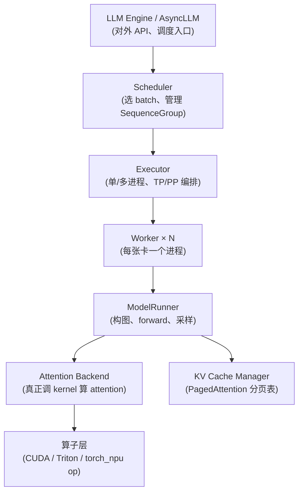
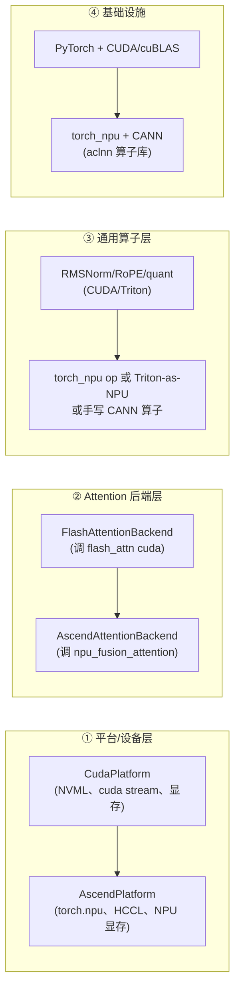

# vLLM NPU 适配预研 · 面试速记（15 分钟版）

> 目标：把简历那句话拆成「名词解释 + 机理 + 迁移路径」三块，能口头复述即可。不涉及实现细节。

---

## 一、推理链路总览（一张图记住）

vLLM V1 的请求从进来到出 token，分层如下：

记住一句话：**Engine 调度 → Executor 编排多卡 → Worker 管一张卡的设备与显存 → ModelRunner 跑前向 → Attention Backend 是 attention 算子的可插拔后端 → 最底是真正执行的计算算子。** NPU 适配就是从下往上「替换算子层 → 加一个 Attention Backend → 加一个 Worker/Platform」。

---

## 二、三个名词 + 机理

### 1. Worker / Executor

- **Executor**：决定「怎么把模型铺到多张卡上」。单卡 = `UniprocExecutor`；多卡走 Ray 或 multiprocessing（`RayExecutor` / `MultiprocExecutor`）。它负责起 worker 进程、建分布式进程组（TP/PP）、把 scheduler 的指令下发。
- **Worker**：每张设备一个进程，持有 `ModelRunner` + KV cache 段 + CUDA graph / 显存池。对外暴露 `execute_model()`，内部真正跑 forward。
- 一句话：**Executor 管「跨卡编排」，Worker 管「单卡执行」**。NPU 要新增一个 `NpuWorker`（设备初始化、显存管理、stream）和对应 executor 分支。

### 2. KV Cache（PagedAttention）

- 把每条序列的 K/V 切成固定大小的 **block**（如 16 token 一块），用一张 **block table**（物理块号 → 逻辑位置）映射，物理块按需分配、可共享（prefix 共享 / copy-on-write）。
- 这让显存利用率接近 100%，且 prefill 产生的 KV 能被 decode 复用、prefix cache 能命中。
- 机理层：`reshape_and_cache_flash` 这类 kernel 把每步算出的 K/V 写进 paged 显存；attention kernel 读 block table 做变长 attention。
- NPU 适配要点：**这两个 kernel 必须有 NPU 版本**（写显存 + 读 paged 表），否则 PagedAttention 跑不起来。

### 3. Attention Backend

- 一个**可插拔抽象**：`AttentionBackend` 定义 `forward()` 调哪个 kernel、metadata 长什么样。vLLM 内置 `FlashAttentionBackend`、`TritonAttentionBackend`、`ROCmAttentionBackend` 等，用 `AttentionBackendEnum` 注册、按平台/配置选择。
- 它把「上层模型代码」和「下层具体 kernel」解耦：模型只写 `attn(q,k,v,metadata)`，换后端不改模型。
- **NPU 适配核心抓手**：实现一个 `AscendAttentionBackend`，内部调 torch_npu 的 `npu_fusion_attention` 等算子。

---

## 三、CUDA → torch_npu / CANN 迁移的关键依赖

按从上到下「替换什么」分层：

**关键依赖（口头能说出 4 点就够）：**

1. **torch_npu**：PyTorch 的昇腾后端插件，`import torch_npu` 后 `torch.npu.*` 可用，提供 `npu_fusion_attention`、`npu_rotary_embedding_position`、`npu_rms_norm` 等 aclnn 封装算子。这是替代 flash-attn / 部分 Triton 的主力。
2. **CANN（Compute Architecture for Neural Networks）**：华为昇腾计算栈，对标 CUDA + cuDNN。底层是 **aclnn 算子库**（C++ 接口），torch_npu 就是对它的 Python 封装。算子语义和 CUDA 不一一对应，常有缺算子需手写 C++ 算子注册。
3. **分布式/通信**：CUDA 走 NCCL，昇腾走 **HCCL**（Huawei Collective Communication Library）。vLLM 的 TP/PP 进程组后端要切到 `hccl`。
4. **显存/内存管理**：CUDA 的 `cudaMalloc`、`torch.cuda.caching_allocator`、`cuMemMap`（vLLM 可选的 cumem allocator）→ NPU 的 `npu_malloc`、torch_npu caching allocator。PagedAttention 的 paged 块分配器要能在 NPU 显存上建。

**迁移落地点（最容易答的一句）**：vLLM 的算子有两种存在形式——`vllm._custom_ops`（C++/CUDA 扩展 + pybind）和 `vllm/model_executor/kernels/`（Triton kernel）。迁移就是把这两类 op，逐个换成 torch_npu 已有算子或新写 aclnn 算子，并在 `AttentionBackend` 层把 flash-attn 调用换成 `npu_fusion_attention`。

---

## 四、"现在 vLLM 已经适配了吧？"

**答：是，但不在 vLLM core 里——以独立插件项目形式适配。**

- vLLM core 提供的是**插件注册机制**（不是硬编码 NPU）：
  - 平台插件：Python entry_points 组 `vllm.platform_plugins`，core 内置只有 cuda/rocm/tpu/xpu/cpu，**Ascend 走 out-of-tree 插件**。
  - Attention 后端：`register_backend()` 可运行时注册新后端。
  - Worker：通过平台抽象 + 插件注入，新增 `NpuWorker`。
- 真正的昇腾适配在 **`vllm-project/vllm-ascend`** 这个独立仓库里（pip install vllm-ascend 即可），它注册 `AscendPlatform` + `AscendAttentionBackend` + 依赖 `torch_npu`/`CANN`。
- core 里有 `.buildkite/hardware_tests/ascend_npu.yaml`，但 `soft_fail: true`（允许 CI 失败），说明适配是社区维护、跟随节奏，不是核心维护重点。

**面试时这么说**："vLLM 的设计是通过平台插件和 attention backend 注册把硬件后端外置化，昇腾适配不在 core 而在 `vllm-ascend` 插件里，依赖 torch_npu + CANN，主要工作是把 flash-attn / RMSNorm / RoPE / 通信后端换成 npu 算子和 HCCL。"

---

## 五、一句话自检（被追问时的安全回答）

- Worker vs Executor：Executor 跨卡编排，Worker 单卡执行。
- KV Cache：PagedAttention 分页 block + block table，物理块共享。
- Attention Backend：attention 算子的可插拔后端抽象。
- 迁移 4 依赖：torch_npu（算子）、CANN/aclnn（底层算子库）、HCCL（通信）、NPU 显存管理。
- 现状：core 留插件口，昇腾实现在 `vllm-ascend` 外置插件，CI soft_fail。
