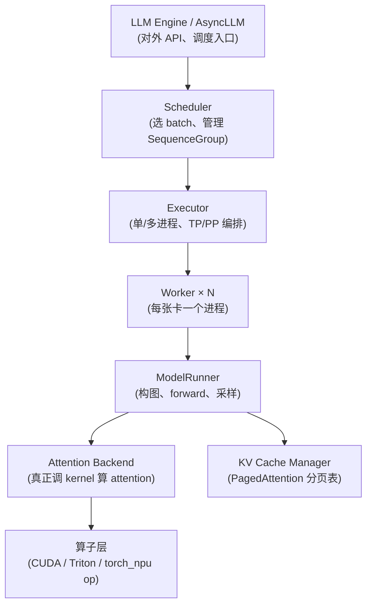
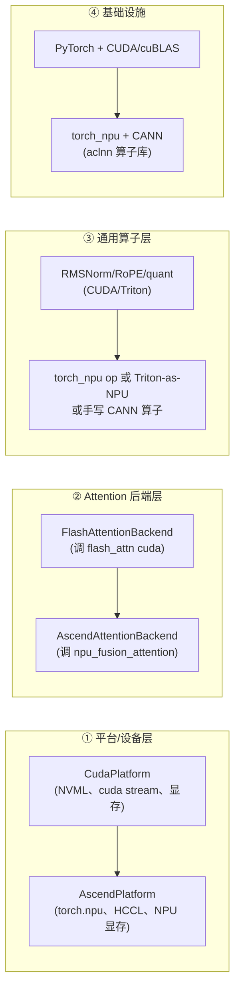
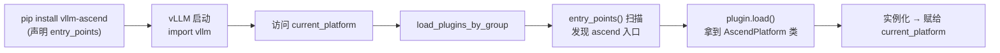

# vLLM NPU 适配预研 · 面试速记（15 分钟版）

> 目标：把简历那句话拆成「名词解释 + 机理 + 迁移路径」三块，能口头复述即可。不涉及实现细节。

---

## 一、推理链路总览（一张图记住）

vLLM V1 的请求从进来到出 token，分层如下：



记住一句话：**Engine 调度 → Executor 编排多卡 → Worker 管一张卡的设备与显存 → ModelRunner 跑前向 → Attention Backend 是 attention 算子的可插拔后端 → 最底是真正执行的计算算子。** NPU 适配就是从下往上「替换算子层 → 加一个 Attention Backend → 加一个 Worker/Platform」。

---

## 二、三个名词 + 机理

### 1. Worker / Executor

- **Executor**：决定「怎么把模型铺到多张卡上」。单卡 = `UniprocExecutor`；多卡走 Ray 或 multiprocessing（`RayExecutor` / `MultiprocExecutor`）。它负责起 worker 进程、建分布式进程组（TP/PP）、把 scheduler 的指令下发。
- **Worker**：每张设备一个进程，持有 `ModelRunner` + KV cache 段 + CUDA graph / 显存池。对外暴露 `execute_model()`，内部真正跑 forward。
- 一句话：**Executor 管「跨卡编排」，Worker 管「单卡执行」**。NPU 要新增一个 `NpuWorker`（设备初始化、显存管理、stream）和对应 executor 分支。

### 2. KV Cache（PagedAttention）

- 把每条序列的 K/V 切成固定大小的 **block**（如 16 token 一块），用一张 **block table**（物理块号 → 逻辑位置）映射，物理块按需分配、可共享（prefix 共享 / copy-on-write）。
- 这让显存利用率接近 100%，且 prefill 产生的 KV 能被 decode 复用、prefix cache 能命中。
- 机理层：`reshape_and_cache_flash` 这类 kernel 把每步算出的 K/V 写进 paged 显存；attention kernel 读 block table 做变长 attention。
- NPU 适配要点：**这两个 kernel 必须有 NPU 版本**（写显存 + 读 paged 表），否则 PagedAttention 跑不起来。

### 3. Attention Backend

- 一个**可插拔抽象**：`AttentionBackend` 定义 `forward()` 调哪个 kernel、metadata 长什么样。vLLM 内置 `FlashAttentionBackend`、`TritonAttentionBackend`、`ROCmAttentionBackend` 等，用 `AttentionBackendEnum` 注册、按平台/配置选择。
- 它把「上层模型代码」和「下层具体 kernel」解耦：模型只写 `attn(q,k,v,metadata)`，换后端不改模型。
- **NPU 适配核心抓手**：实现一个 `AscendAttentionBackend`，内部调 torch_npu 的 `npu_fusion_attention` 等算子。

---

## 三、CUDA → torch_npu / CANN 迁移的关键依赖

按从上到下「替换什么」分层：



**关键依赖（口头能说出 4 点就够）：**

1. **torch_npu**：PyTorch 的昇腾后端插件，`import torch_npu` 后 `torch.npu.*` 可用，提供 `npu_fusion_attention`、`npu_rotary_embedding_position`、`npu_rms_norm` 等 aclnn 封装算子。这是替代 flash-attn / 部分 Triton 的主力。
2. **CANN（Compute Architecture for Neural Networks）**：华为昇腾计算栈，对标 CUDA + cuDNN。底层是 **aclnn 算子库**（C++ 接口），torch_npu 就是对它的 Python 封装。算子语义和 CUDA 不一一对应，常有缺算子需手写 C++ 算子注册。
3. **分布式/通信**：CUDA 走 NCCL，昇腾走 **HCCL**（Huawei Collective Communication Library）。vLLM 的 TP/PP 进程组后端要切到 `hccl`。
4. **显存/内存管理**：CUDA 的 `cudaMalloc`、`torch.cuda.caching_allocator`、`cuMemMap`（vLLM 可选的 cumem allocator）→ NPU 的 `npu_malloc`、torch_npu caching allocator。PagedAttention 的 paged 块分配器要能在 NPU 显存上建。

**迁移落地点（最容易答的一句）**：vLLM 的算子有两种存在形式——`vllm._custom_ops`（C++/CUDA 扩展 + pybind）和 `vllm/model_executor/kernels/`（Triton kernel）。迁移就是把这两类 op，逐个换成 torch_npu 已有算子或新写 aclnn 算子，并在 `AttentionBackend` 层把 flash-attn 调用换成 `npu_fusion_attention`。

---

## 四、"现在 vLLM 已经适配了吧？"

**答：是，但不在 vLLM core 里——以独立插件项目形式适配。**

- vLLM core 提供的是**插件注册机制**（不是硬编码 NPU）：
  - 平台插件：Python entry_points 组 `vllm.platform_plugins`，core 内置只有 cuda/rocm/tpu/xpu/cpu，**Ascend 走 out-of-tree 插件**。
  - Attention 后端：`register_backend()` 可运行时注册新后端。
  - Worker：通过平台抽象 + 插件注入，新增 `NpuWorker`。
- 真正的昇腾适配在 **`vllm-project/vllm-ascend`** 这个独立仓库里（pip install vllm-ascend 即可），它注册 `AscendPlatform` + `AscendAttentionBackend` + 依赖 `torch_npu`/`CANN`。
- core 里有 `.buildkite/hardware_tests/ascend_npu.yaml`，但 `soft_fail: true`（允许 CI 失败），说明适配是社区维护、跟随节奏，不是核心维护重点。

**面试时这么说**："vLLM 的设计是通过平台插件和 attention backend 注册把硬件后端外置化，昇腾适配不在 core 而在 `vllm-ascend` 插件里，依赖 torch_npu + CANN，主要工作是把 flash-attn / RMSNorm / RoPE / 通信后端换成 npu 算子和 HCCL。"

---

## 五、一句话自检（被追问时的安全回答）

- Worker vs Executor：Executor 跨卡编排，Worker 单卡执行。
- KV Cache：PagedAttention 分页 block + block table，物理块共享。
- Attention Backend：attention 算子的可插拔后端抽象。
- 迁移 4 依赖：torch_npu（算子）、CANN/aclnn（底层算子库）、HCCL（通信）、NPU 显存管理。
- 现状：core 留插件口，昇腾实现在 `vllm-ascend` 外置插件，CI soft_fail。

---

## 六、四层迁移的通俗解释

| 层 | 通俗讲 | 谁来换 |
|---|---|---|
| ④ 基础设施 | PyTorch 这个"框架" + 它调用的底层计算库 | 装 `torch_npu`，一次到位 |
| ③ 通用算子 | vLLM **自己手写**的私有算子（不走标准 PyTorch op） | 逐个手动替换 |
| ② Attention 后端 | attention 这一个大算子的"可插拔实现" | 写一个 Ascend 后端 |
| ① 平台/设备 | 设备初始化、stream、显存、通信 | 写一个 AscendPlatform |

### 重点：④ vs ③ 的本质区别

**核心区别：是不是"标准 PyTorch 算子"。**

**④ 基础设施层 —— 框架级、隐式、批量**
- 你写的 `torch.mm`、`torch.softmax`、`torch.layer_norm` 这些 **PyTorch 内置 op**，torch_npu 装好之后**一行代码不改**，自动走 NPU。
- 原理：PyTorch 有个 **dispatcher（算子分发机制）**。tensor 在 NPU 上时，dispatcher 自动把 op 路由到 aclnn 实现。
- 你干的活：`pip install torch_npu` + `import torch_npu`，完事。
- **不是"逐个替换算子"，是"换一个算子实现后端"。**

**③ 通用算子层 —— 应用级、显式、逐个**
- vLLM 有大量**自己写的算子**，不是标准 PyTorch op：
  - C++/CUDA 扩展：`vllm/_custom_ops.py` 里 pybind 出来的 fused kernel，如 `reshape_and_cache_flash`（写 KV cache）、`rms_norm`
  - Triton kernel：`vllm/model_executor/kernels/` 下 vLLM 自己用 Triton 写的
- torch_npu **不认识这些私有算子**，必须显式替换，三种方式：
  1. 换成 torch_npu 提供的封装算子（如 `npu_rms_norm`、`npu_rotary_embedding_position`）
  2. 重写成标准 PyTorch op（让 ④ 的 dispatcher 自动接手）
  3. 实在没有 → 手写 C++ 算子注册到 aclnn

### 类比

换餐厅后厨：
- **④ 基础设施** = 换掉**水电燃气 + 通用锅碗瓢盆**。装好之后，**任何厨师用标准厨具做菜都自动用新火**——你不用管。
- **③ 通用算子** = vLLM 自带的**私房菜秘方 + 定制模具**。通用厨具做不出来，要么**买对应新模具**（torch_npu 的封装算子），要么**自己造**（手写 CANN 算子）。

> 结论：④ 不是"替换算子"是"换算子实现后端"（装好全局生效）；③ 才是真正"逐个替换算子的苦活"。

---

## 七、插件原理深挖（怎么插入/在哪个文件/怎么一下子替换这么多）

### 1. 插件原理：Python entry_points（核心）

vLLM 不需要你改它的代码。用的是 Python 标准的 **entry_points 插件发现机制**（和 pip 命令、pytest 插件同机制）。

**插件包自己声明：我是谁** —— vllm-ascend 在它**自己的** `pyproject.toml` 里写：

```toml
[project.entry-points."vllm.platform_plugins"]
ascend = "vllm_ascend.platform:AscendPlatform"
```

意思："我在 `vllm.platform_plugins` 这个插件组里注册一个叫 `ascend` 的入口，指向 `vllm_ascend.platform` 模块里的 `AscendPlatform` 类。"

**vLLM 那边发现它** —— `vllm/platforms/__init__.py` 调 `load_plugins_by_group(PLATFORM_PLUGINS_GROUP)`，而 `vllm/plugins/__init__.py` 干的事就是：

```python
from importlib.metadata import entry_points
discovered_plugins = entry_points(group=group)  # 扫描所有已装包的 pyproject.toml
```

**Python 解释器会扫描所有已安装包，把它们的 entry_points 汇总。** vllm-ascend 一旦 `pip install`，vLLM 启动就能发现。

### 2. "在哪个文件插入？" —— 不改 vLLM 任何文件

关键认知：**插件是另一个独立 pip 包**。装 vllm-ascend 后，它的代码在 `site-packages/vllm_ascend/` 下，vLLM 一行代码不改。插入点全靠 entry_points 声明 + vLLM 预留的加载钩子。

加载流程：



### 3. "怎么一下子替换这么多地方？" —— 三个机制叠加

不是真的"改很多文件"，而是 **vLLM core 全程调抽象接口，插件提供具体实现，靠多态 + 注册表自动路由**。

**机制 1：Platform 多态（替换平台/worker/通信）**

vLLM core 永远通过 `current_platform.xxx()` 调用，从不直接写死 CUDA。`Platform` 抽象基类（`vllm/platforms/interface.py`）定义一堆钩子：

```python
class Platform:
    def get_attn_backend_cls(self): ...          # 用哪个 attention backend
    def get_device_communicator_cls(self): ...   # NCCL 还是 HCCL
    def get_worker_cls(self): ...                # 用哪个 Worker
```

`AscendPlatform(Platform)` 重写这些方法返回 NPU 版本。`current_platform` 被换成 AscendPlatform 实例后，**vLLM 所有地方调 `current_platform.get_device_communicator_cls()` 自动拿到 HCCL 类**——一次切换，全局生效。

**机制 2：register_backend 运行时注册（替换 attention backend）**

attention backend 不是 entry_points 发现的，而是**插件被 load 时执行 Python 代码的副作用**。`registry.py` 提供：

```python
@register_backend(AttentionBackendEnum.FLASH_ATTN)
class AscendAttentionBackend:
    ...
```

vllm-ascend 的平台插件被 `plugin.load()` 时，会 import 它的 attention backend 模块，模块顶层执行这个装饰器，把 `FLASH_ATTN → AscendAttentionBackend` 写进 `_ATTN_OVERRIDES` 字典。之后 vLLM 的 selector 选 backend 时查这个字典，自动拿到 ascend 类。

**机制 3：算子 monkey-patch / 重定向（替换通用算子）**

vLLM 调 `from vllm._custom_ops import rms_norm`。插件 load 时可把这些 op 替换掉：

```python
# vllm-ascend 插件加载时
import vllm._custom_ops as ops
ops.rms_norm = npu_rms_norm              # 直接替换函数引用
ops.reshape_and_cache_flash = ...        # 换成 npu 版本
```

vLLM 各处 `from vllm._custom_ops import rms_norm` 拿到的就是 NPU 版。

### 4. 一句话总结

> vLLM core 全程调抽象（`current_platform` 的方法、attention backend 注册表、`_custom_ops` 算子表），**从不写死 CUDA**。vllm-ascend 作为独立 pip 包，靠 entry_points 被发现加载，加载时干三件事：①实例化 AscendPlatform 赋给 `current_platform`（多态路由平台/worker/通信）②import 它的 attention backend 触发 `register_backend`（改注册表）③monkey-patch `_custom_ops`（换算子）。三件事做完，vLLM 所有调用点自动走 NPU，**不需要改 vLLM 一行代码**。

被追问记住三个关键词：**entry_points 发现、Platform 多态、register_backend + monkey-patch 注册**。这是 vLLM 把硬件后端外置化的全部秘密。
