# vLLM KV-Aware Scheduling 项目面试讲义

> 目标：帮助没有读过 vLLM 源码的人，从零讲清楚项目背景、Phase 1～7
> 主线及 Phase 8 后续算子探索的设计、实现、性能结果和技术边界。
> 项目分支：`project/kv-aware-scheduling`
> 主要环境：RTX 4090、Qwen2.5-7B-Instruct、vLLM V1、PyTorch 2.13.0+cu130。

---

## 1. 简历可直接使用的项目描述

### vLLM KV-Aware Scheduling：大模型推理调度与 CUDA 数据面优化

**技术栈：Python / C++ / CUDA / PyTorch / CUPTI / vLLM**

**项目背景：** 基于 vLLM V1 Scheduler、Paged KV Cache 与 Automatic Prefix
Caching，针对高并发推理中 **缓存命中请求排队、抢占恢复重复计算及 KV 写入线程
空转**问题，设计 KV 感知调度策略，并优化 FlashAttention 后端的分页 KV Cache
写入路径。

**项目职责：**

- **KV 感知调度：** 深入 V1 Scheduler 与 KVCacheManager，设计
  **recompute-aware 抢占、Top-W cache-affinity admission 和 aging 公平性保护**，
  综合用户优先级、缓存前缀长度、剩余 prefill 及恢复重算成本动态选择请求。

- **KV 状态一致性：** 设计按 KV generation 失效的懒加载特征上下文，仅对
  Top-W 候选解析昂贵 prefix 特征，并覆盖 allocation、free、eviction、deferred
  free 等状态边界；减少 **7.94% 重复 prefix 查询**，策略 CPU 开销约占 serving
  wall time **0.41%**。

- **端到端性能优化：** 在 16 类共享前缀、1250 KV blocks 的官方双向 A/B
  压测中，实现 **output throughput +4.20%**、**总耗时 -4.00%**、
  **TTFT P99 -2.24%**、**TPOT P99 -15.43%**；在独立 attribution A/B 中通过
  新增恢复重算指标，观察到 **resume recompute -5.52%** 和
  **本地上下文计算 -3.37%**，为收益机制提供支持。

- **CUDA 算子优化：** 优化分页 KV Cache 写入的 launch configuration，
  按有效向量数将 Qwen 代表形状从 **512 threads 缩减至 64
  threads**，CUPTI 微基准实现 **1.45x 加速**；设计 alignment-gated
  **16-byte 向量化 RoPE 双并行快路径**，在真实 fused-QKV 布局下实现
  **1.13x～1.84x 算子加速**，并保留其他 dtype、layout 与 rotary 变体的
  通用 fallback。

### 1.1 简历数字的使用边界

| 可以写 | 不能写 |
|---|---|
| 1250-block、16-prefix 代表 workload 吞吐 +4.20% | vLLM 所有场景吞吐都提升 4.20% |
| 生产 KV 写入算子微基准最高 1.45x | vLLM 服务吞吐提升 45% |
| 生产 RoPE 代表形状微基准 1.13x～1.84x | 服务端到端已提升 84% |
| 设计并实现 KV-aware 策略和实验开关 | 从零实现 PagedAttention/APC |
| 通过机制指标发现恢复重算下降 5.52% | 已证明这是唯一因果路径 |
| 在 RTX 4090/Qwen2.5-7B 上验证 | 已跨 GPU、跨模型普遍生效 |

---

## 2. 先用一句话理解整个项目

> vLLM 原来主要按 FCFS 或用户优先级调度请求；本项目让 Scheduler 在严格边界内
> 感知“哪个请求已经缓存了更多前缀、恢复它要重算多少 token、抢占它能释放多少
> KV 页”，选择更合适的执行顺序；然后继续向下优化把 K/V 写入分页 Cache 的 CUDA
> Kernel。

项目同时覆盖两条路径：

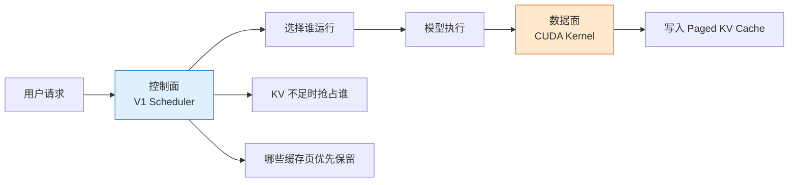

- **控制面优化：** Phase 1～6，决定请求和 KV block 的顺序；
- **数据面优化：** Phase 7 优化 K/V 写入；Phase 8 继续验证
  fused add + RMSNorm 和 RoPE 两个每层生产算子。

---

## 3. 必须先懂的基础概念

## 3.1 LLM 推理为什么分 Prefill 和 Decode

假设输入是“请介绍一下北京”，模型首先一次性处理整段 prompt，然后逐 token
生成答案。

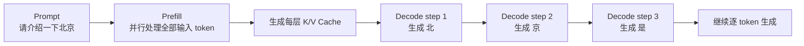

- **Prefill：** 一次处理很多输入 token，矩阵乘法规模大，通常更偏计算密集；
- **Decode：** 每一步通常为每个请求生成一个 token，但要读取之前所有 token 的
  K/V Cache，容易受显存带宽和 batch 组成影响；
- **恢复重算：** 请求被抢占后如果其 K/V 被释放，再恢复时需要重新执行一部分
  prefill，这部分是可以被调度优化减少的浪费。

## 3.2 KV Cache 是什么

Transformer attention 会为每个历史 token 计算 Key 和 Value。生成下一个 token
时仍需要这些历史 K/V。如果每一步都从头计算，成本非常高，所以把它们保存在 GPU
显存中，这就是 **KV Cache**。

可以把它理解为模型生成过程的“中间结果存档”：

```text
没有 KV Cache：每次生成新 token，都重新计算整个上文
有 KV Cache：  只计算新 token，并读取之前保存的 K/V
```

KV Cache 很大。请求越多、上下文越长，占用的 GPU 显存越多。因此 Scheduler
不仅要分配计算时间，还要管理稀缺的 KV 空间。

## 3.3 Paged KV Cache 是什么

传统连续内存要求每个请求预留一整块大空间，容易造成碎片。vLLM 把 KV Cache
切成固定大小的 block，类似操作系统分页。本项目主实验中一个 block 保存 16 个
token 的 K/V。

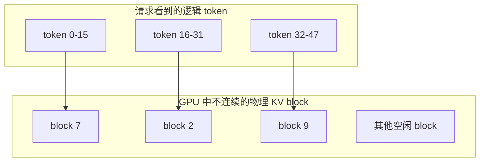

请求的 block table 保存“逻辑第几个 block 对应物理哪个 block”。这样不要求
物理内存连续，也能按需扩容。

## 3.4 Automatic Prefix Caching 是什么

多个请求可能拥有相同前缀，例如：

```text
请求 A：系统提示词 + 文档 X + 问题 1
请求 B：系统提示词 + 文档 X + 问题 2
```

系统提示词和文档 X 的 K/V 完全相同。APC 会按完整 block 的 token hash 查找已有
K/V，使请求 B 跳过这部分 prefill。

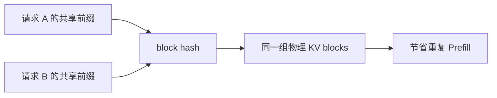

这里有三个容易混淆的概念：

- **cache query：** 尝试查询了多少 prefix token；
- **cache hit：** 查询时已经存在多少可复用 token；
- **resume recompute：** 请求被抢占后，恢复时实际重复计算了多少旧 token。

Cache hit 更多不一定吞吐更高，因为请求顺序还会影响 batch 组成、抢占时机和
decode/prefill 竞争。

## 3.5 Block 的 refcount、free 和 eviction

一个物理 KV block 可能被多个请求共享，所以有引用计数 `ref_cnt`。

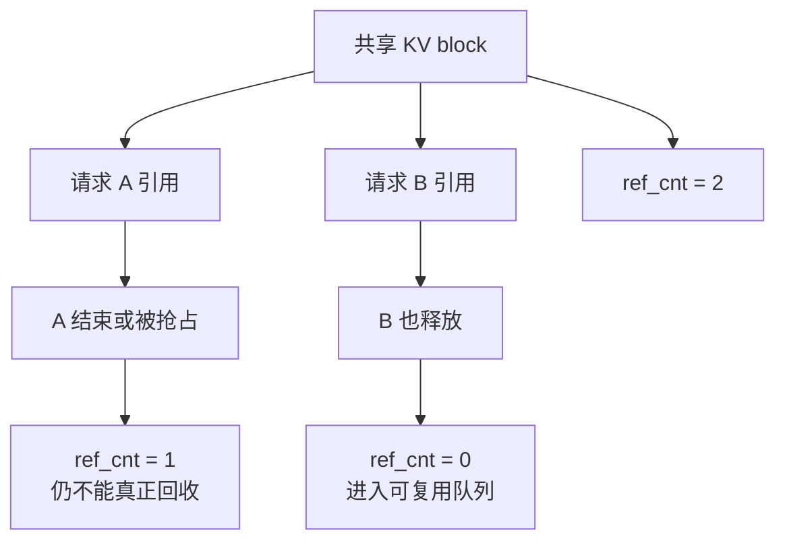

`ref_cnt=0` 不代表里面的数据立刻被清零。它可以暂时留在 prefix cache 中；当新请求
需要空间时，BlockPool 从 free queue 取 block，旧 hash 才被淘汰。默认选择通常遵循
LRU 思路。

还有一个重要边界叫 **deferred free**：GPU 可能仍在异步写这个 block，Scheduler
逻辑上已经释放，但要等 write fence 完成后，物理页才能真正回到 free queue。

## 3.6 Scheduler 在做什么

V1 Scheduler 每轮大致做三件事：

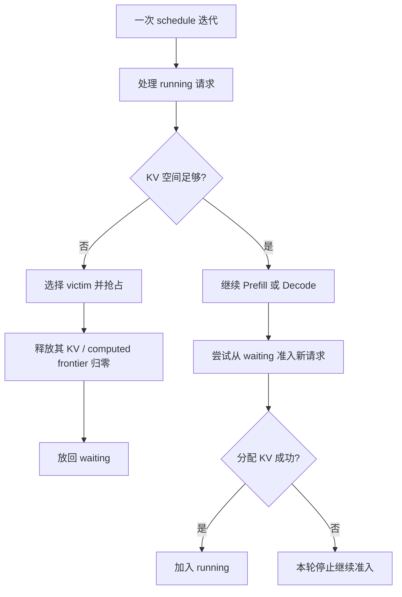

- **Admission：** 从 waiting 中选择哪个请求进入 running；
- **Preemption：** KV 不够时从 running 中选择哪个请求暂停；
- **Victim：** 被抢占的请求；
- **Resume：** 被抢占请求重新进入 running；
- **Aging：** 请求等得太久后恢复基础队列优先级，防止饿死。

---

## 4. 项目总体设计

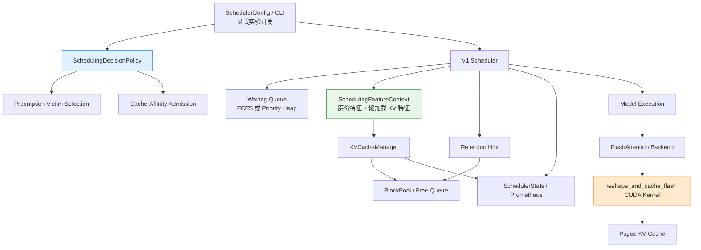

几个关键设计原则：

1. **默认兼容：** 所有实验策略通过显式配置开启，默认行为不变；
2. **决策与状态修改分离：** policy 只读选择，真正的 free、状态转换仍由 Scheduler
   正式路径完成；
3. **昂贵特征按需计算：** 只在需要的候选窗口和真实 allocation failure 上扫描；
4. **Priority 是硬约束：** KV heuristic 不跨越更高用户优先级；
5. **先证明激活，再讨论收益：** 每项性能结果都检查策略是否真的改变了选择；
6. **控制面与数据面分离：** 调度策略与 CUDA Kernel 不互相叠加归因。

## 4.1 这些优化不是“拍脑袋”：完整发现方法

整个项目采用下面的推导循环，而不是先写一堆 heuristic 再找数据证明：

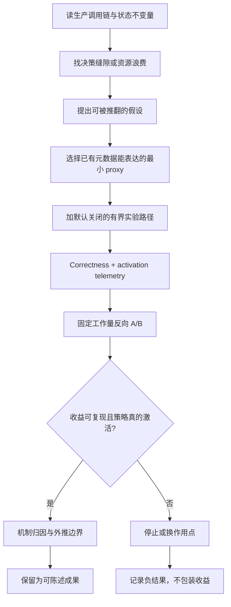

每次优化前都先回答：

1. **状态不变量是什么？** 例如 priority 不能被 KV heuristic 越过，deferred-free
   页不能被当成立即可用；
2. **真正可修改的缝隙在哪？** 修改 victim/admission 的只读选择，不重写正式
   free 和 Request 状态机；
3. **成本上界是什么？** Top-W 而不是全队列，allocation failure 才扫描
   reclaimability；
4. **怎样证明代码真的改变了行为？** 记录 reordered admission、changed victim、
   avoided eviction，而不是只看吞吐；
5. **怎样推翻自己的解释？** 加反事实 baseline、换 KV budget、改变 prefix
   diversity、做反向运行顺序。

## 4.2 论文与社区工作的关系

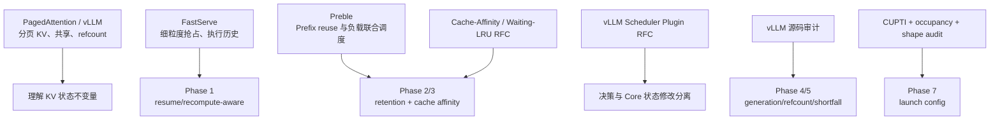

来源分为三类，面试时必须区分：

| 类型 | 含义 | 本项目例子 |
|---|---|---|
| 直接思想启发 | 论文提出过相同的上层问题 | FastServe 的抢占历史、Preble 的 prefix-aware scheduling |
| 工程设计一致 | 社区 RFC 指向相似扩展边界 | policy 只决策、lazy read-only feature、bounded cache affinity |
| 独立源码推导 | 不是照搬论文，而是从本版本代码和测量得到 | KV generation、refcount estimator、one-block 退化、512→64 threads |

### PagedAttention 给了什么基础

[PagedAttention/vLLM 论文](https://arxiv.org/abs/2309.06180)把操作系统分页思想用于
KV Cache：逻辑 KV block 可以映射到不连续物理 block，还可以通过 refcount 在请求
间共享。它直接解释了本项目为什么能讨论 block-level allocation、共享前缀和
reclaimability。

但本项目**没有重新实现 PagedAttention**。它是在现有分页和 APC 机制之上修改
Scheduler 决策，并优化一个 KV 写入辅助算子。

### FastServe 给了什么启发

[FastServe](https://arxiv.org/abs/2305.05920)指出自回归推理天然允许细粒度抢占，
并用 MLFQ/skip-join 让执行历史参与调度。项目吸收的是：

> 请求不是无状态任务；已经执行过、被抢占过、恢复时要付出多少成本，应影响下一次
> 决策。

项目没有复刻 FastServe 的完整 MLFQ、CPU offload 或分布式架构，而是把想法缩小为
vLLM V1 内部的 binary resume protection 和 token-based recompute proxy。

### Preble 给了什么启发

[Preble](https://arxiv.org/abs/2407.00023)把 prompt sharing 视为 stateful
scheduling 问题，联合考虑 KV 复用和计算负载。项目吸收的是：

> 调度请求时不能只看到达顺序，还要考虑请求已经驻留在 GPU 上的可复用状态，以及
> 利用这些状态后剩余的计算量。

Preble 主要解决多 GPU routing 和层次化调度。本项目没有复刻其全局 prefix tree
或 E2 算法，而是缩小为单 GPU、block-hash APC 上的 Top-W local admission。

### vLLM 社区 RFC 给了什么工程边界

- [Cache-affinity request ordering #42185](https://github.com/vllm-project/vllm/issues/42185)
  说明 FCFS waiting order 可能忽略已存在的 cached prefix，并讨论 priority 与
  anti-starvation；
- [Waiting-Queue-Informed LRU #48485](https://github.com/vllm-project/vllm/issues/48485)
  强调只改变 free cached block 的选择顺序，不 pin、不预留容量；
- [Extensible Scheduler Plugin Framework #51608](https://github.com/vllm-project/vllm/issues/51608)
  强调 side-effect-free、lazy feature、bounded scoring，以及状态修改保留在 Core；
- [Priority Scheduling #6077](https://github.com/vllm-project/vllm/issues/6077)
  提供 priority、preemption、resume 组合的社区背景。

这些 RFC 与项目方向一致，但项目仍以冻结 commit 的源码和本机实验为准，没有直接
复制 RFC 实现。

## 4.3 Phase 1 是怎样推导出来的

### 第一步：从抢占状态机发现“损失不是一样大”

源码审计看到：请求被抢占时会释放 KV、`num_computed_tokens` frontier 回滚，然后
重新进入 waiting。假设两个同 priority 请求：

```text
A 已计算 2,000 tokens
B 已计算   100 tokens
```

如果其他条件相同，抢占 A 会丢掉更多可复用计算。由此得到第一个低成本 proxy：

```text
recompute_cost(request) ≈ request.num_computed_tokens
```

这不是精确 GPU 时间模型，但它已经存在于 Request、读取 O(1)、没有 profiler 或
预测误差引入的额外状态，非常适合作为第一版决策信号。

### 第二步：发现“抢占次数”不能直接当连续权重

如果按 `num_preemptions=1,2,3...` 连续排序，状态每次变化都会改变请求相对位置，
可能形成新的抖动。因此把历史压缩成二元语义：

```text
fresh = 从未被抢占
resumed = 至少被抢占一次
```

只保护 resumed，不奖励“被抢占次数更多”。这与 FastServe“执行历史参与调度”的
思想一致，但实现更保守。

### 第三步：为什么 priority 必须在 recompute 之前

用户 priority 是外部 QoS 合同，recompute cost 是内部效率目标。如果反过来，高
priority 但刚开始运行的请求可能因为成本小而被低 priority 长请求抢掉，破坏 API
语义。因此使用字典序，而不是混合魔法分数：

```text
(user priority tier, resume protection, recompute cost, stable tie-break)
```

### 第四步：为什么要冻结 heap key

Priority heap 的正确性要求 item 在 heap 内比较键稳定。但 Request 的
`num_preemptions` 会变化。若比较时动态读取，数组不再满足 heap property。因此在
入队时冻结 key；真实 preemption 后重新入队时才生成新 key。

### 拒绝的方案

- **完整 MLFQ：** scope 太大，且需要重新定义用户 QoS；
- **KV swap/offload：** 改变恢复机制，不是最小调度 patch；
- **精确运行时间预测：** 需要模型/硬件 profile，第一版没有必要；
- **跨 priority 保护昂贵请求：** 效率 heuristic 不能覆盖用户合同。

## 4.4 Phase 2/3 是怎样从缓存问题推导出来的

### 先从 LRU 的信息盲区出发

LRU 只回答“过去谁最久没用”，waiting queue 则包含“近期谁可能要用”。如果一个
free-but-cached block 即将被队头附近请求命中，纯 LRU 没有这个未来需求信号。

这与 Preble 的 prefix locality 思想和 waiting-informed LRU RFC 一致，于是先做最小
改动 Phase 2：只改变 free cached block 的淘汰次序。

### 为什么先做 soft retention，而不是 pin

Pin 会让“账面上有 free block，实际上不能分配”，改变 allocation feasibility，
甚至制造 OOM。Soft hint 只让 allocator 先找别的 free block，不足时仍完整 fallback：

```text
收益最好情况：保住即将命中的 prefix
最坏 correctness：退化到原 LRU，分配仍能完成
```

### Phase 2 的数据为什么推动 Phase 3

Telemetry 显示 W=8 做了约 149 万次 retained-block 引用，只实际避开 247 次 LRU
队头淘汰；最终只多 576 hit tokens。说明“等到 eviction 才保护”的作用点太晚、
机会太稀疏。

于是把作用点前移到 admission：既然 warm 请求已经有状态，就让它在严格范围内更早
使用该状态，而不是赌它的 block 恰好将在这几轮被淘汰。

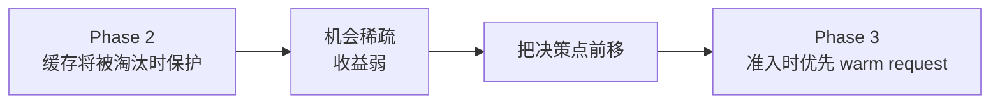

### 为什么不是“cache hit 最大者优先”

一个请求命中 900 tokens、总 prompt 100,000 tokens，仍有大量 prefill；另一个只
命中 500 tokens、总 prompt 520 tokens，几乎可直接 decode。因此比较：

```text
remaining_prefill = request_tokens - local_cached_tokens
```

它比 raw hit 更接近真实剩余工作量，也与 Preble“复用与负载共同考虑”的原则一致。

### 为什么是 Top-W + Aging

- 全队列排序会把 Scheduler hot path 变成 O(N) prefix probe；
- 任意远处的 warm request 都能插队，会破坏公平性；
- W 限制影响范围，priority 限制 QoS 边界，aging 给冷请求最终进场保证。

30s 是最初用于验证机制是否能充分激活的激进点；观察 TTFT 退化后，再用 5s 和 10s
形成 trade-off 曲线。10s 两对吞吐均为正且达到预设 Gate 后就停止，没有继续搜索
7s、12s 等“最好看的魔法参数”。

### 拒绝的方案

- **全 waiting queue 排序：** CPU 无界且公平性差；
- **跨 user priority 选择：** 破坏 QoS；
- **只按 raw cached tokens：** 忽略总 prompt 和剩余工作；
- **复杂加权总分：** 在信号尚未验证前容易过拟合；
- **完整复刻 Preble：** 多 GPU routing、prefix tree 和负载模型超出单机目标。

## 4.5 Phase 4 为什么采用 Generation，而不是 TTL

Phase 3 首轮压力数据出现约 104 次 candidate probe 才有一次成功 admission。源码
跟踪发现同一批 waiting 请求在 KV 不足时被重复探测，Phase 2 retention 和 Phase 3
admission 还会重复查询相同 local prefix。

自然想到 memoization，但 prefix 查询结果会在这些事件后变化：

```text
allocate / free / eviction / CoW / cache reset / remote KV receive
```

如果用 10ms TTL，可能在 allocation 后的下一轮继续使用旧 physical block 对象；
如果把缓存字段长期塞进 Request，又会形成跨 Scheduler iteration 的隐式状态。

因此使用常见的 generation-counter 思路：

```text
KV 状态没有变化 -> 同 generation 内复用
任何潜在 mutation -> generation + 1，全部 KV-derived memo 失效
```

这不是来自某一篇特定 LLM 论文，而是从 cache coherence/versioning 的通用工程模式
与 vLLM mutation 点推导出来的。它优先保证“不读旧状态”，再获取有限复用收益。

## 4.6 Phase 5 为什么从 Retention Tier 走到 Refcount

### 5a：二值 retained 信息不够

Phase 2 把所有 waiting demand 等权。源码里已经有 user priority、resume state，
所以自然把这些稳定语义映射为离散 tier，而不是难解释的浮点分数：

```text
NONE < NORMAL < RESUMED < HIGH_PRIORITY
```

离散 tier 内保持 LRU，能明确回答每一次淘汰为什么发生，也保留原队列稳定性。

### 5b：为什么 raw block count 是错的

PagedAttention 允许多个请求共享 physical block。请求 A 的 block table 出现 20 页，
其中 15 页也被 B 引用，那么抢占 A 只能最终归还 5 页。于是 estimator 必须比较：

```text
目标请求拥有的引用重数 == 物理 block 的全部 ref_cnt
```

这是从 PagedAttention/refcount 不变量和实际 vLLM block bookkeeping 推导的，不是
直接照搬 Preble/FastServe 算法。

### 5c：为什么 feasibility 必须排在 recompute cost 前

假设 allocation 缺 4 页：

```text
候选 A：重算成本 10 tokens，但只能立即释放 0 页
候选 B：重算成本 100 tokens，但能立即释放 4 页
```

选 A 再便宜也无法推进 retry，所以先判断“能否填补 shortfall”，再在可行候选中
最小化重算。该思路类似约束优化中的 lexicographic feasibility-first，而不是把
容量和成本随意加权。

### 为什么要区分 eventual 与 immediate

异步 GPU write 未完成时，逻辑 free 不代表物理页马上回池。若把 eventual estimate
直接用于当前 retry，Scheduler 会认为容量已经释放，实际却仍不足。因此用 fence/
sequence 状态把这种候选的 immediate reclaimability 置 0。

### 为什么“失败结果”仍是技术亮点

原 A/B 有约 2% 正数，如果只看结果很容易误判。反事实 telemetry 证明 1,922 次
decision 中新旧策略 0 次改选，因为 shortfall 永远为 1。这个结果不仅否定伪收益，
还给出算法生效的必要条件：必须存在 multi-block shortfall 或 baseline victim
zero-progress。

## 4.7 Phase 6 是怎样一步步收敛，而不是无限调参

### 先修复测量，再谈优化

早期客户端把 SSE chunk 当 token，且模型可能提前 EOS，导致不同调度运行的总工作量
不同。发现方法是逐请求对齐 output length、usage 和 hash，发现相同输入却生成工作量
不一致。于是固定：`ignore_eos`、completion tokens、warmup、fresh process 和反向
运行顺序。

### 每个子阶段只回答一个问题

| 子阶段 | 唯一问题 | 决策 |
|---|---|---|
| 6b | Phase 5c 真改 victim 了吗 | 0/1,922，否定收益 |
| 6c | 隔离 Phase 3 admission 后是否真有吞吐收益 | 有，但 30s TTFT 很差 |
| 6d | aging 能否收回公平性 | 10s 保留 +3.17% 吞吐，停止 sweep |
| 6e | Scheduler CPU 会吃掉收益吗 | 约 0.41% wall，不是主因 |
| 6f | 换到 1000 KV blocks 还能生效吗 | -0.60%，外推失败 |
| 6g | W 从 8 降到 4 能否兼得吞吐与公平 | 吞吐消失，停止 window sweep |
| 6h | prefix 数从 8 到 16 是否仍有收益 | +4.20%，通过 shape 泛化 Gate |
| 6i | 收益到底来自什么 | 重算更少、batch/engine step 更好 |

### 为什么使用反向顺序 A/B

GPU 温度、时钟、后台状态可能随时间变化。如果永远 C→T，后运行的策略可能系统性
占便宜。使用 C1→T1、T2→C2，让顺序偏差分别作用于两边；要求两对方向都为正，再
比较均值。

### 为什么要看 activation telemetry

性能是结果，activation 是因果前提：

```text
admission 优化 -> 必须看到 admitted_reordered > 0
victim 优化    -> 必须看到 changed_selections > 0
retention 优化 -> 必须看到 avoided_evictions > 0
```

没有行为变化，即使吞吐差 10%，也不能归因于算法。

## 4.8 Phase 7 是怎样从形状推导出 512→64 threads

### 第一步：不碰 GEMM，先找项目相关的小型 memory-bound op

设计阶段先排除 GEMM、主 Attention 和 MoE：这些算子由 cuBLAS/CUTLASS/FlashAttention
长期优化，短期重写风险高。KV write 与项目主线直接相关，且是 addressing + memory
copy 类型，容易建立准确的 bytes 和 correctness 模型。

### 第二步：追生产调用链，而不是优化一个 demo

从 Qwen 的 FlashAttention backend 一直跟到
`csrc/libtorch_stable/cache_kernels.cu`，确认实际调用的是
`reshape_and_cache_flash_kernel`。再从模型配置得到 4 KV heads、head size 128、
BF16、NHD。

### 第三步：审计现有代码，发现不是“缺少向量化”

kernel 已经用 16-byte pack，每线程搬 8 个 BF16。host launcher 却仍按 scalar
element 数决定 block threads：

```text
scalar elements = 4 * 128 = 512
vector work     = 512 / 8 = 64
```

由此提出可验证假设：512-thread block 中 448 个线程没有 vector work，降低每 SM
可驻留的独立 token block 数。

### 第四步：用三种证据验证，而不是只看一次计时

1. ptxas：26 registers/thread、0 spill、0 shared memory；
2. occupancy API：64/128/256/512 threads 对应 24/12/6/3 active blocks per SM；
3. 隔离 probe + 生产 op 同工具链 A/B：64 threads 在 1024/2048 token 都获益。

Kernel-KBS 的 `technique-ampere-optimization` 页面只提供通用佐证：memory-bound
kernel 应先检查 coalescing/vectorization，并且不能把 occupancy 当作唯一目标。具体
的 64-thread 配置是本项目根据 SM89 设备、Qwen shape 和源码独立推导，不是从该
知识库照抄。

### 为什么没有使用 cp.async/shared memory

KBS 对有数据复用的 tile kernel 推荐 `cp.async` 和 shared-memory pipeline；但 KV
write 的每个元素只读一次、写一次，没有后续计算复用。加 shared memory 会多一次
写入、读取和同步，因此与该算子的数据流不匹配。

## 4.9 Phase 8 是怎样选出 RMSNorm 和 RoPE 的

Phase 7 结束后不是随便挑两个 CUDA 文件。先沿 Qwen2.5-7B 一层的真实
forward 路径做“算子户口”：

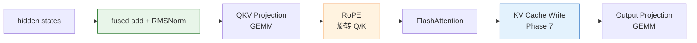

选择标准不是“名字听起来厉害”，而是四个问题：

1. 它是否真在 Qwen 每层调用？
2. 是否真走 vLLM 自己的 CUDA 实现？
3. 能否用简单 PyTorch 公式做 correctness oracle？
4. 源码中是否有“可证伪”的 launch 或访存假设？

GEMM 和主 Attention 虽然占时更大，但已有 cuBLAS/CUTLASS/FlashAttention 长期优化，
很难在短周期内通过重写取得可信收益。RMSNorm 和 RoPE 则同时满足上述四项。

### RMSNorm：从“有效 vector task 数”发现空线程

Qwen hidden size 是 3584，vLLM 的对齐 BF16 path 每线程处理 8 个元素：

```text
3584 scalar elements / 8 elements per vector = 448 vector tasks
```

但旧 small-token launcher 用 `min(hidden_size, 1024)`，所以启动 1024 线程。这与
Phase 7 的发现很像，但不能直接推导“会大幅加速”，因为 RMSNorm 还有 block
reduction，并且同 FlashInfer 的初步对比已经接近持平。

因此只做一个最小 A/B：aligned vector path 用 448 threads，generic fallback 完全
不动。最终 1～64 token 只快 1%～4%，128 以上基本持平。这说明源码假设是
对的，但性能影响较小。面试时要主动给出这个边界。

### RoPE：先从数学式判断它不是 GEMM

[RoFormer](https://arxiv.org/abs/2104.09864) 定义的 RoPE 本质是对每个二维向量做旋转：

```text
x' = x * cos(theta) - y * sin(theta)
y' = y * cos(theta) + x * sin(theta)
```

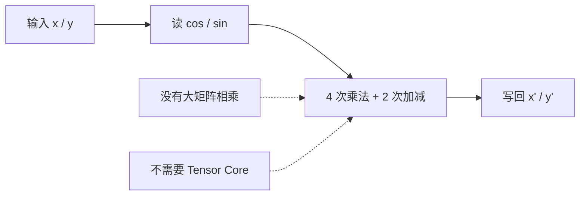

因此它是低算术强度的 elementwise transform，应优先看向量访存和并行映射，而不是
GEMM tiling。原 vLLM 对 Qwen 固定每 token 启动一个 512-thread block，每个
thread 处理标量 pair。只有 1 个 decode token 时，整张 128-SM 的 4090 只有一个
CTA 可调度，并行度天然不足。

### 参考 FlashInfer，但没有把它当成黑盒替换

[FlashInfer 论文](https://arxiv.org/abs/2501.01005) 提供 serving-native kernel 设计背景；
进一步阅读其公开
[`pos_enc.cuh`](https://github.com/flashinfer-ai/flashinfer/blob/main/include/flashinfer/pos_enc.cuh)，
发现它使用两个关键技巧：

- 每线程处理 16 bytes，BF16 即 8 个元素；
- 工作量小时展开 head 维，工作量大时展开 token 维并复用 cos/sin。

vLLM 本身有一段被注释禁用的 FlashInfer RoPE path，注释明确写着“due to
failures”，并且该 path 要求 FP32 cos/sin cache。所以没有简单地把开关打开，
而是保留 vLLM 现有 BF16 cache 和 stable ABI，在原 CUDA 文件中实现受限快路径。

### 为什么是两种并行方式

Qwen 每个 head 有 128 个 BF16，一个 16-byte vector 是 8 个 BF16，所以只需
16 threads 覆盖一个 head。

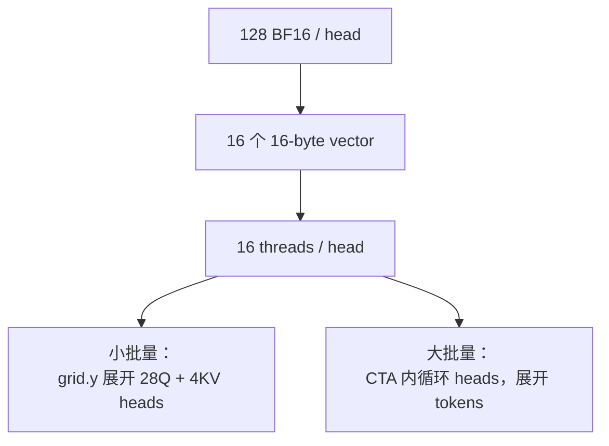

- **Head-parallel：** 一个 CTA 处理一个 head 和最多 8 个 token。一个 token 也能产生
  32 个 CTA，改善小 batch SM 利用率；
- **Token-parallel：** 一个 CTA 处理最多 8 个 token，同一 token 的 cos/sin 在循环
  32 个 head 时复用，适合 token 数足够多的场景。

### 错误阈值怎样帮助找到正确设计

首轮凭直觉在 256 token 切换 token-parallel。1～128 token 明显变快，但 256 token
由 baseline 约 10.6 us 退化到 16.1 us，慢了约 52%。这说明 256 token 的
token grid 仍不足以填满 GPU，过早收回 head 并行是错的。

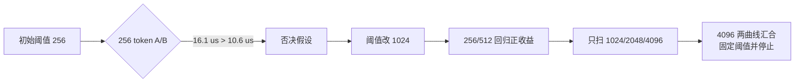

最后的 4096 不是论文给的常数，而是 RTX 4090 + Qwen 形状下两条曲线的实测
交点。这是面试中最值得讲的过程：先用开源实现建立方向，再用自己的生产
layout 和反例数据确定具体设计。

### 为什么原有 benchmark 不能直接用

原 RMSNorm benchmark 把 clone/reset 放在 timed lambda 中，测到的不只是 kernel；原 RoPE
benchmark 没有使用 Qwen 的 28Q/4KV GQA 形状，也没有保留 fused-QKV split 后的
token stride。所以新建 CUPTI 脚本：

- 性能循环用全零 fixed point，不在计时区内 clone；
- 随机输入单独与 PyTorch 公式对比；
- Q/K 从同一 fused-QKV tensor split，保留真实 stride；
- cold L2 + CUDA Graph + 5 trials，并用旧/新 `.so` 反向切换。

## 4.10 一张图记住“问题如何推动下一阶段”

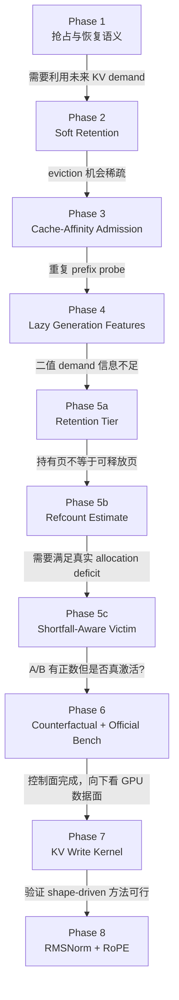

## 4.11 面试时如何回答“这是你想的还是论文想的”

推荐回答：

> 上层问题不是我凭空发明的。FastServe 证明执行历史和抢占值得参与 LLM serving
> 调度，Preble 证明 prefix locality 应和计算负载共同考虑，vLLM 社区也有
> cache-affinity 和 waiting-informed LRU RFC。我的工作是把这些思想缩小到当前
> vLLM V1 的单 GPU 决策缝隙：保持 priority 和 Core 状态机不变，设计 Top-W、aging、
> generation invalidation、refcount/deferred-free 边界，并用反事实 telemetry 和
> 官方 A/B 筛掉不生效的策略。Phase 7 的 512→64 threads 来自生产调用链、
> 模型 shape、向量宽度和 occupancy 的独立测量。Phase 8 的 RoPE 数学语义
> 来自 RoFormer，16-byte/head-token 双并行方向参考 FlashInfer，但 BF16 cache
> 兼容、stable ABI 接入、fused-QKV stride、安全 fallback 和 4096 切换点是我在
> vLLM/RTX 4090 环境里独立实现与测出的。

这比回答“全部原创”更可信，也能说明你有阅读系统工作、落地和验证的完整能力。

---

## 5. Phase 1：可恢复的 Recompute-Aware 抢占

## 5.1 原问题

一个请求被抢占后，已经计算的 token frontier 会回滚。如果它重新排队后又很快被
抢占，就会反复重算。Priority 调度还存在另一个风险：请求入 heap 后字段变化，若
排序时直接读取可变字段，会破坏 heap 顺序。

## 5.2 改造思路

在相同 user-priority 层内：

```text
选择 victim：
1. 优先抢占从未被抢占的 fresh 请求，保护 resumed 请求
2. 再选 num_computed_tokens 更少的请求，减少丢掉的计算
3. arrival_time + request_id 稳定打破平局

重新准入：
1. 不跨越更高 user priority
2. 同层 resumed 请求先于 fresh 请求
```

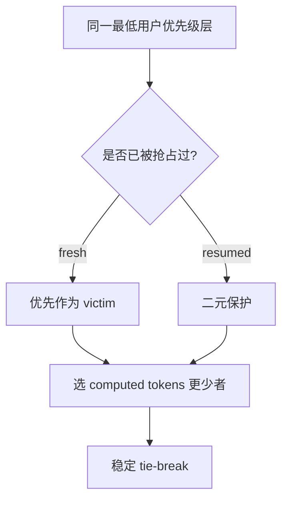

“二元保护”表示只区分抢占过或没抢占过，不使用 `num_preemptions=1/2/3` 的精确
次数继续排序，避免次数本身形成新的抖动。

## 5.3 关键工程点

- 抽出只读 `SchedulingDecisionPolicy`；
- Priority heap 保存入队时冻结的 `(key, request)`；
- waiting 与 skipped-waiting 合并时也比较冻结 key；
- policy 不负责释放 KV，也不修改 Request 状态。

## 5.4 结果与边界

Phase 1 的 correctness 通过。确定性复核曾观察到抢占从 100 降到 64，但吞吐和
延迟没有稳定改善，不能把这一阶段单独包装成性能成功。

**面试一句话：** Phase 1 建立了可扩展的抢占决策边界，并解决 Priority heap
使用可变请求状态排序的问题，为后续 KV-aware 策略提供安全基础。

---

## 6. Phase 2：Waiting-Queue-Aware Prefix Retention

## 6.1 原问题

默认 LRU 只知道“哪个 free block 最久没用”，不知道 waiting queue 中马上要运行的
请求是否正好需要它。可能出现：

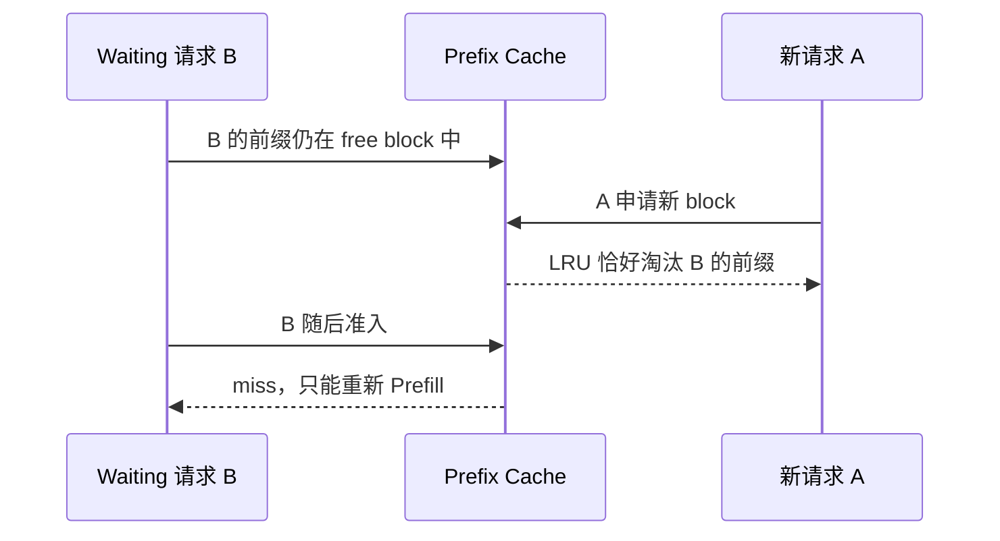

## 6.2 改造思路

对 waiting 队头附近 W 个请求做只读 prefix peek，把它们可能复用的 physical block
作为 soft retention hint：

```text
分配新 block 时：
先从 non-retained free blocks 中选择
如果不够，再回退使用 retained blocks
```

它不是 pin：不会减少 free block 总数，也不会导致本来可成功的 allocation 失败。

## 6.3 为什么结果不强

- 热门 prefix 常被 running 请求引用，本来就不会被淘汰；
- retention 的保护窗口很短；
- W 个请求的所有 block 被等权处理，没有价值排序；
- 为保护一个旧 block，可能反而淘汰另一个更有价值的新 block。

严格固定工作量后，W=8 相对 LRU 只多 576 个 prefix-hit tokens、少 4 次抢占、单轮
吞吐约 +0.83%，不足以越过噪声 Gate。

**面试一句话：** Phase 2 证明 soft-retention 机制正确且确实改变淘汰，但局部保护
没有稳定转化为 serving 收益，因此没有继续堆复杂 value heuristic，而转向更直接的
admission 排序。

---

## 7. Phase 3：有界 Cache-Affinity Admission

## 7.1 核心想法

与其等请求的缓存被淘汰时再保护，不如在多个请求都能运行时，让“更快进入有效
decode”的请求先运行。

只查看真实队列前 W=8 个、且不跨越不同 user priority：

```text
1. 等待超过 aging threshold 的请求优先，防饿死
2. resumed 请求优先，减少恢复等待
3. remaining prefill = request tokens - local cached tokens
4. remaining prefill 更小者先运行
5. 基础队列位置稳定打破平局
```

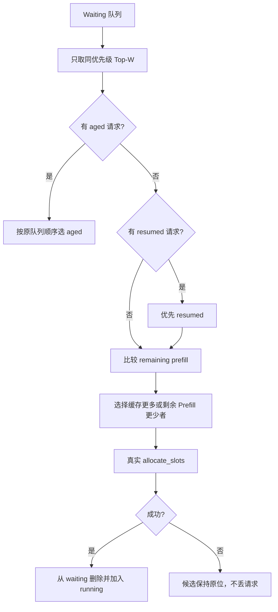

## 7.2 为什么必须是 Top-W

如果 waiting 中有 N 个请求，每轮扫描所有请求并查询 prefix，Scheduler CPU 会随
队列长度增长。W=8 把策略成本限制在小常数范围。

Priority queue 底层是 heap，数组前 W 个不等于排序前 W 个。本项目使用 heap
frontier，只展开已弹出节点的孩子：

```text
Top-W 读取：O(W log W)，而不是 O(N log N)
中间候选删除：O(log N)，维护 request identity -> heap index
```

## 7.3 Aging 为什么必要

如果永远优先缓存命中高的请求，冷请求可能一直排队。Aging 是公平性阀门：等待
达到阈值后，重新按基础 FCFS/Priority 顺序选择。

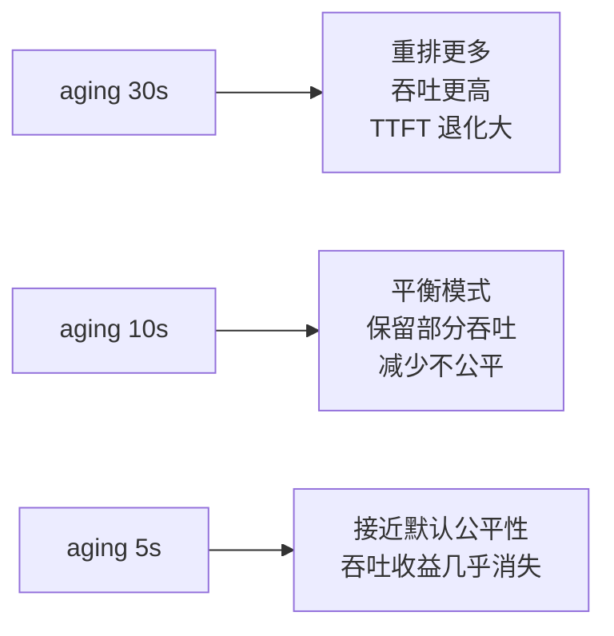

## 7.4 最终效果

- 激进 30s 模式：吞吐均值 +4.286%、mean TPOT -9.190%，但 TTFT p99 +58.975%；
- 平衡 10s 模式：8-prefix workload 吞吐 +3.169%、mean TPOT -5.722%；
- 16-prefix 泛化 workload：吞吐 **+4.204%**、duration **-3.999%**、TTFT p99
  **-2.235%**、TPOT p99 **-15.432%**。

**面试一句话：** Phase 3 是最终调度收益的核心，通过有界 cache-affinity 改善
running batch 组成，并用 aging 显式控制 throughput/fairness trade-off。

---

## 8. Phase 4：Lazy SchedulingFeatureContext

## 8.1 为什么需要这一层

Phase 2 retention 和 Phase 3 admission 都会查询 local prefix。如果每个 consumer
重复查询，会浪费 Scheduler CPU；但长期缓存又可能读到已经被 allocation/free
改变的旧 block 状态。

## 8.2 Cheap 与 Expensive 特征分离

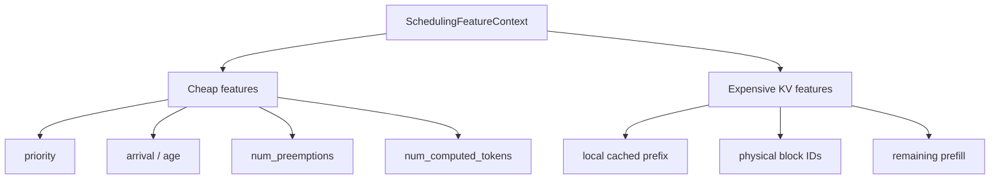

Cheap feature 直接读 Request 元数据；expensive feature 需要进入 KVCacheManager、
查 block hash 和协调多个 KV group。

## 8.3 KV Generation 失效

```mermaid
stateDiagram-v2
    [*] --> GenerationN
    GenerationN --> CacheHit: 同一请求再次查询
    CacheHit --> GenerationN
    GenerationN --> GenerationN1: allocate/free/evict/reset/remote KV mutation
    GenerationN1 --> ResolveAgain: 下一次查询
    ResolveAgain --> GenerationN1
```

只要任何操作可能改变 KV 可见性，就执行：

```text
generation += 1
clear memoization
```

这比固定 TTL 更安全，因为 KV 状态变化并不与时间严格对应。固定压力实验中减少
**7.944% resolver 调用**。默认 admission + LRU 路径不创建 context。

**它是不是优化？** 它是控制面性能与正确性基础，不是主要端到端收益来源。简历中
要和 Top-W admission、CPU 成本一起说，不能单独包装成“架构重构”。

---

## 9. Phase 5：从 Retention Tier 到 Reclaimable KV

Phase 5 分为 5a、5b、5c。它的价值主要是把 KV block 的 demand、引用和立即回收
语义讲清楚；最终 workload 没有证明 5c 的性能收益。

## 9.1 Phase 5a：Priority/Demand-Aware Retention

Phase 2 只有 retained/not-retained 两档。Phase 5a 改成四级：

```text
tier 0：没有近期 waiting demand
tier 1：普通 near-head 请求需要
tier 2：resumed 请求需要
tier 3：相对更高 user-priority 请求需要
```

```mermaid
flowchart LR
    T0[tier 0<br/>最先淘汰] --> T1[tier 1<br/>普通 demand]
    T1 --> T2[tier 2<br/>resumed demand]
    T2 --> T3[tier 3<br/>高优先级 demand<br/>最后淘汰]
```

同 tier 内保持原 LRU；空间不足时从低到高全部 fallback，所以不改变 allocation
可行性。两对 A/B 吞吐均值 +1.970%，但 prefix hit、preemption 和 TTFT 分位数
方向混合，只通过 correctness Gate。

## 9.2 Phase 5b：只读 Reclaimable-KV Estimate

“一个请求持有 20 个 block”不代表抢占它就能释放 20 个 block，因为其中一些可能
与其他请求共享。

对每个 physical block：

```text
owned_refs = 目标请求自己持有该 block 的引用次数
total_ref  = block.ref_cnt

只有 owned_refs == total_ref，释放目标请求后该物理页才最终可回收
```

```mermaid
flowchart TD
    B[物理 KV block] --> O{目标请求持有的引用<br/>等于总 refcount?}
    O -- 是 --> Y[目标请求释放后可回收]
    O -- 否 --> N[仍被其他请求或 GPU 操作引用]
```

实现还处理：

- 同一请求的重复 bookkeeping 引用；
- 多 KV group；
- null padding；
- partial-tail pin；
- CoW/write-fence 等 operation retention。

该 estimator 是只读信息层，没有接入策略，因此 Phase 5b 本身不声称性能收益。

## 9.3 Phase 5c：Allocation-Shortfall-Aware Preemption

只有真实 `allocate_slots()` 失败后才计算：

```text
shortfall = required physical blocks - available physical blocks
```

Victim 顺序：

```text
1. 最差 user-priority tier
2. 最大化 min(immediately_reclaimable, shortfall)
3. 保护 resumed 请求
4. 最小化 recompute tokens
5. 稳定 tie-break
```

这里区分：

- **eventual reclaimable：** 正式 free 流程最终能归还多少页；
- **immediate reclaimable：** 本次 retry 之前马上能用多少页；
- 若 deferred free 的 GPU fence 未完成，immediate 值必须记为 0。

## 9.4 为什么 5c 最终没有性能收益

反事实 telemetry 比较“recompute-aware 本来会选谁”和“reclaimable-aware 实际选
谁”。三个 workload 共 1,922 次真实决策：

```text
每次 shortfall 都等于 1 block
原 recompute victim 每次都能释放至少 1 block
min(reclaimable, shortfall) 对所有可行候选都等于 1
因此 changed selections = 0
```

```mermaid
flowchart TD
    S[shortfall = 1] --> A[候选 A 可回收 1]
    S --> B[候选 B 可回收 10]
    A --> MA[min = 1]
    B --> MB[min = 1]
    MA --> SAME[容量排序键相同]
    MB --> SAME
    SAME --> FALL[退化回 recompute-aware]
```

早期 A/B 曾出现约 +2%～+2.8% run-level 差异，但由于策略一次都没改选，必须认定
为运行波动，不能写成算法收益。

**面试价值：** 这证明你没有看到正数就宣布成功，而是用 counterfactual 指标验证
策略是否激活，并找出 one-block shortfall 下的数学退化条件。

---

## 10. Phase 6：性能测量、泛化与机制归因

Phase 6 不是“无休止调参”，而是按问题逐层排除错误结论。

```mermaid
flowchart TD
    A[Phase 6<br/>CPU + 官方 bench] --> B[6b 反事实诊断<br/>否定 Phase 5c 伪收益]
    B --> C[6c 隔离 Admission<br/>确认 +4.286% 吞吐]
    C --> D[6d Aging Sweep<br/>找到 10s 平衡点]
    D --> E[6e CPU Microbenchmark<br/>策略成本约 0.41% wall]
    E --> F[6f KV Budget 1000<br/>外推失败]
    F --> G[6g Window 4<br/>公平性回收但吞吐消失]
    G --> H[6h Prefix 16<br/>+4.204% 泛化确认]
    H --> I[6i 机制归因<br/>恢复重算 -5.523%]
```

## 10.1 为什么官方 `vllm bench serve` 更可信

早期自定义脚本把 SSE content chunk 当作 token，并且生成长度不固定。Phase 2
复核后修正为：

- `ignore_eos=true`，确保固定输出 token 数；
- 从 API usage 读取真实 completion tokens；
- 正式运行前 warmup；
- 每轮使用 fresh server process；
- C→T 与 T→C 反向顺序 A/B，降低时间顺序偏差；
- 保存输入/输出 token、finish reason 和策略激活 counters；
- 最终以官方 `vllm bench serve` 为对外指标。

## 10.2 重要指标解释

| 指标 | 含义 | 越小/越大越好 |
|---|---|---|
| Output throughput | 每秒生成 token 数 | 越大越好 |
| TTFT | 请求到第一个 token 的时间 | 越小越好，反映排队+prefill |
| TPOT | 第一个 token 后平均每个输出 token 时间 | 越小越好，反映 decode 效率 |
| ITL | 相邻输出 token 间隔 | 越小越平滑 |
| Duration | 完成固定工作量的总时间 | 越小越好 |
| Preemptions | 请求被抢占次数 | 不是越少必然越好，要结合重算成本 |
| Resume recompute | 恢复时重复计算的旧 token | 越少越好 |

## 10.3 Scheduler CPU 成本

Cache-affinity W=8：

```text
default fast path：0.172 us/decision
同 generation 热缓存：30.433 us/decision
KV mutation 后冷解析：78.466 us/decision
实际累计上界：约 serving wall time 的 0.406%
```

所以它不是零开销，但在目标 workload 中不是主要瓶颈。W 增大时成本近似线性，
因此坚持有界 Top-W，而不是扫描全队列。

## 10.4 为什么最终选择 16-prefix 结果

8-prefix 的 10s aging 已有 +3.169% 吞吐，但 TTFT 仍有明显 trade-off。将 prefix
种类增至 16 后，每个 prefix 的复用频率降低，是更困难的 locality 场景。两对反向
A/B 仍分别 +5.632% 和 +2.758%，均值 +4.204%，并且 TTFT p99 也下降 2.235%。

这证明收益不是恰好只对 8 个 prefix 生效。但 1000 KV blocks 的外推结果为负，
所以不能声称跨 KV budget 普遍提升。

## 10.5 性能归因到底做了什么

只看 preemption 次数会得到错误结论：最终 attribution 中 treatment 的抢占反而
增加 12.531%，但吞吐仍提升。

新增两个只读 counter：

```text
preempted_computed_tokens：抢占时丢掉的 computed frontier
resume_recompute_tokens：恢复区间与旧 frontier 的真实重叠部分
```

它会扣除 APC 恢复的 prefix，也不把从未计算过的新进度误算成重算。

```mermaid
flowchart LR
    A[抢占前已计算 0..1000] --> B[请求被抢占]
    B --> C[APC 恢复 0..400]
    C --> D[重新计算 400..1000]
    D --> E[继续新进度 1000..1200]

    C -.不计为重算.-> X[缓存命中 400]
    D -.计入.-> Y[resume recompute 600]
    E -.不计为重算.-> Z[首次计算的新 token 200]
```

最终一对机制 A/B：

- output throughput **+2.695%**；
- resume recompute **-5.523%**；
- total local context compute **-3.372%**；
- engine outputs **-6.415%**；
- compute tokens / engine output **+4.962%**；
- preemptions 反而 **+12.531%**。

因此最可信解释不是“命中更多”或“抢占更少”，而是 admission 顺序让每次恢复的
成本更低、running batch 更高效，以更少 engine step 完成相同输出。

## 10.6 Phase 6j 状态

原计划用 Qwen3-0.6B 验证小模型规模边界，但尚未执行。当前结论只覆盖主实验的
Qwen2.5-7B，不能在面试中声称已经完成跨模型泛化。

---

## 11. Phase 7：优化 `reshape_and_cache_flash` CUDA Kernel

## 11.1 这是什么算子

模型产生的新 K/V 通常是连续 tensor：

```text
key/value shape = [num_tokens, num_kv_heads, head_size]
```

Paged KV Cache 的物理位置不连续。`slot_mapping[token]` 告诉 kernel 每个 token
应该写到哪个物理 slot。

```mermaid
flowchart LR
    K[连续 Key Tensor] --> OP[reshape_and_cache_flash]
    V[连续 Value Tensor] --> OP
    S[slot_mapping<br/>token -> physical slot] --> OP
    OP --> P1[Paged KV block 7 / slot 3]
    OP --> P2[Paged KV block 2 / slot 9]
    OP --> P3[Paged KV block 9 / slot 1]
```

生产调用链：

```text
FlashAttention backend
  -> fa_utils.do_kv_cache_update
  -> vllm._custom_ops.reshape_and_cache_flash
  -> torch.ops._C_cache_ops.reshape_and_cache_flash
  -> csrc/libtorch_stable/cache_kernels.cu
```

它不是 attention score 计算，也不是 GEMM；它是低算术强度、以内存访问为主的
**向量化 scatter/store kernel**。

## 11.2 与 GEMM 的区别

| 对比 | GEMM | KV Cache 写入 Kernel |
|---|---|---|
| 核心工作 | `C=A×B` | 按 slot mapping 搬运 K/V |
| 性能属性 | 通常计算密集 | 内存和 launch 开销主导 |
| 主要硬件 | Tensor Core | load/store 单元和显存 |
| 数据复用 | 高，可做 tile | 几乎没有跨 token 复用 |
| 优化重点 | tiling、shared memory、寄存器复用 | 合并访存、向量化、线程利用率、block 配置 |
| 衡量指标 | TFLOPS、Tensor Core utilization | latency、GB/s、有效 warp 比例 |

## 11.3 发现的瓶颈

Qwen2.5-7B：

```text
num_kv_heads = 4
head_size    = 128
BF16 elements per token = 4 * 128 = 512

一次 16-byte vector copy = 8 个 BF16
真正需要的线程数 = 512 / 8 = 64
```

旧 launcher 却按 scalar element 数启动 512 threads：

```mermaid
flowchart TB
    B[一个 512-thread block] --> W0[warp 0<br/>有效拷贝]
    B --> W1[warp 1<br/>有效拷贝]
    B --> W2[warp 2-15<br/>没有 vector 可搬<br/>空转]
```

旧配置有 16 个 warp，只有 2 个有效，有效 warp 比例 12.5%。每个 SM 最多驻留
3 个这种 512-thread block；改为 64 threads 后可驻留 24 个 token block。

注意：两者理论 occupancy 都可以显示 100%。这里关键不是 occupancy 百分比，而是
同一时间有多少独立 token block、多少 warp 真正在搬数据。

## 11.4 安全 fast path

没有把 block size 无条件改成 64，而是检查：

- `kv_cache_dtype == auto`；
- NHD 连续 head layout；
- scalar K/V scale；
- key、value、两个 cache 基地址 16-byte 对齐；
- row/block/page stride 能被 vector size 整除；
- 有效 vector threads 至少为 64；
- 线程数向上对齐到完整 warp，最大仍为 512。

FP8、HND、per-head scale、非对齐 row 都走原 fallback。没有添加
`__launch_bounds__`，因为同一个模板 kernel 还要支持通用 512-thread 路径。

## 11.5 为什么不继续加 shared memory

现有 key/value 读和 cache 写已经是连续 16-byte pack，warp 内访问已合并。这个
算子没有可重复利用的数据，引入 shared memory 只会多一次中转和同步，通常不会
增加收益。

## 11.6 结果

| tokens | 原 CUDA | 候选 CUDA | 加速 |
|---:|---:|---:|---:|
| 512 | 6.177 us | 5.088 us | 1.214x |
| 1024 | 9.569 us | 6.592 us | **1.452x** |
| 2048 | 16.495 us | 11.871 us | **1.390x** |
| 4096 | 30.333 us | 28.446 us | 1.066x |

1024/2048-token 下还分别比当前 Triton 路径快 23.2%/22.2%。小 token 主要受
wrapper 和 launch 固定成本影响；4096 token 更接近带宽饱和，所以相对收益回落。

## 11.7 为什么 1.45x 不等于服务吞吐 +45%

Qwen2.5-7B 有 28 层。1024-token 形状每层节省约 2.977 us，粗略总和约 83 us；
2048-token 约节省 129 us。Prefill 的 attention/GEMM 时间远大于 KV 写入，所以
端到端变化预计低于 1%，容易落入 serving 波动。

**正确说法：** 生产 KV-cache 写入算子微基准最高 1.45x。
**错误说法：** vLLM 服务吞吐提升 45%。

---

## 12. 后续 Phase 8：RMSNorm 与 RoPE 生产算子

Phase 8 不改变项目的 Phase 1～7 主线，是在主线已保存后，用同一套
“真实 shape → 源码假设 → microbenchmark → 生产 fast path → fallback”方法再
验证两个算子。

## 12.1 先讲清 RMSNorm 是什么

LayerNorm 会减均值再除以标准差；RMSNorm 省去减均值，用均方根归一化：

```text
r = input + residual
variance = mean(r * r)
output = r * rsqrt(variance + epsilon) * weight
```

vLLM 把“残差相加”与“RMSNorm”融合成一个 kernel，避免先写中间 tensor 再
读回。这个 kernel 同时包含：

```mermaid
flowchart LR
    I[input] --> ADD[residual add]
    R[residual] --> ADD
    ADD --> REDUCE[sum of squares<br/>block reduction]
    REDUCE --> SCALE[rsqrt + weight]
    SCALE --> O[normalized output]
    ADD --> RS[updated residual]
```

它比 KV write 复杂，因为还有跨线程 reduction。所以把 1024 threads 改为 448 后
并不会按线性比例变快。

## 12.2 RMSNorm 改了什么

`csrc/libtorch_stable/layernorm_kernels.cu` 原来在知道 scalar/vector path 之前就统一
计算 block size。改动后：

```text
aligned vector path:
    min(hidden_size / 8, max_block_size)

generic fallback:
    min(hidden_size, max_block_size)
```

Qwen hidden size 3584 对应 448 threads。只改 host launcher，kernel 数学语义、
CUB reduction、dtype 和 fallback 都不动。

| tokens | 原配置 | 候选配置 | 加速 |
|---:|---:|---:|---:|
| 1 | 2.720 us | 2.687 us | 1.012x |
| 4 | 2.720 us | 2.656 us | 1.024x |
| 16 | 3.008 us | 2.880 us | **1.044x** |
| 32 | 3.648 us | 3.584 us | 1.018x |
| 64 | 4.927 us | 4.864 us | 1.013x |
| 128 以上 | — | — | 基本持平 |

面试表达：这不是项目最强的亮点，但可以说明你会识别“看似有问题但
上限很小”的优化，不会将 4% 包装成 40%。

## 12.3 RoPE 的旧线程映射

Qwen 代表形状：

```text
Q heads      = 28
KV heads     = 4
head size    = rotary dim = 128
half dim     = 64
```

原 kernel 的 Q 循环共有 `28 * 64 = 1792` 个 scalar pair，K 循环有
`4 * 64 = 256` 个 scalar pair。每 token 只启动一个 512-thread block：

```mermaid
flowchart TB
    OLD[旧：1 token = 1 CTA] --> B[512 threads]
    B --> Q[thread-stride loop<br/>1792 Q pairs]
    B --> K[second loop<br/>256 K pairs]

    NEW[新：16 threads = 1 head vector] --> HP[head-parallel<br/>小/中 token]
    NEW --> TP[token-parallel<br/>大 token]
```

不能只说“用了向量化”，因为真正的收益有两部分：

- 访存：从标量 BF16 改为每线程 16-byte 连续 load/store；
- 并行度：小 token 不再只有一个 CTA，而是展开 28Q+4KV 个 head。

## 12.4 向量线程如何完成旋转

以线程 0 为例，它负责 head 前半的 0～7 号 BF16：

```text
self vector   = x[0:8]
paired vector = y[64:72]
cos vector    = cos[0:8]
sin vector    = sin[0:8]
output        = self * cos - paired * sin
```

线程 8 则负责对应后半：

```text
self vector   = y[64:72]
paired vector = x[0:8]
output        = self * cos + paired * sin
```

```mermaid
flowchart LR
    X0[x0..x7] --> T0[thread 0]
    Y0[y0..y7] --> T0
    CS[cos0..7 / sin0..7] --> T0
    T0 --> XO[x'0..x'7]

    X0 --> T8[thread 8]
    Y0 --> T8
    CS --> T8
    T8 --> YO[y'0..y'7]
```

16 个 x 维线程刚好覆盖 128 个元素。block 的 y 维为 8，所以一个 CTA 可以
同时覆盖最多 8 个 token。计算时转 FP32，写回时转回 FP16/BF16，与原实现
的数值语义一致。

## 12.5 两条 dispatch 路径

```mermaid
flowchart TD
    A[RoPE call] --> G{fast-path 条件全满足?}
    G -->|No| F[原 scalar fallback]
    G -->|Yes| N{num_tokens < 4096?}
    N -->|Yes| H[Head-parallel<br/>grid.y = Q heads + KV heads]
    N -->|No| T[Token-parallel<br/>CTA 内循环 heads]
```

Head-parallel 为什么适合 decode？一个 token 也能创建 32 个 CTA，而不是只创建
1 个。Token-parallel 为什么适合大 prefill？此时 token 本身已提供大量 CTA，再拆
head 的收益消失，在 CTA 内复用 cos/sin 更简洁。

## 12.6 为什么 fast path 条件看起来很严格

向量 load/store 不能靠“大多数时候对齐”。新 path 同时检查：

| 条件 | 原因 |
|---|---|
| key 存在 | 快路径同时映射 Q/K heads |
| positions 是一维连续 | 与 production token indexing 一致 |
| NeoX style | 前半/后半配对公式专用 |
| head size = rotary dim = 128 | 向量配对与模板形状确定 |
| Q/K/cache 同 dtype 且为 2-byte | 一个 vector 固定处理 8 个元素 |
| 基地址 16-byte 对齐 | 保证 128-bit 访存安全 |
| token/head stride 可被 8 整除 | 每一行和 head 仍保持向量对齐 |

不满足时不报错，而是回到原 scalar kernel。这就是 production fast path 和只能跑
benchmark 的 demo kernel 的区别。

## 12.7 RoPE 结果

下表的 Q/K 来自一个 fused-QKV tensor，不是为了 benchmark 特意制造的理想连续
layout。

| tokens | 原 scalar | 新 vector | 加速 |
|---:|---:|---:|---:|
| 1 | 3.584 us | 1.952 us | **1.836x** |
| 4 | 3.616 us | 2.016 us | **1.794x** |
| 8 | 3.776 us | 2.080 us | **1.815x** |
| 16 | 3.936 us | 2.304 us | 1.708x |
| 32 | 4.416 us | 2.816 us | 1.568x |
| 64 | 5.472 us | 3.712 us | 1.474x |
| 128 | 8.032 us | 4.735 us | 1.696x |
| 256 | 10.559 us | 6.431 us | 1.642x |
| 512 | 19.103 us | 11.296 us | 1.691x |
| 1024 | 31.919 us | 20.895 us | 1.528x |
| 2048 | 55.965 us | 43.775 us | 1.278x |
| 4096 | 97.596 us | 86.460 us | 1.129x |

1～512 token 的主收益来自 head 并行和 16-byte 向量化；token 数增大后 GPU 原本已更
容易被填满，因此收益逐步回落。但 4096 token 仍有约 12.9% 延迟下降。

## 12.8 正确性和测试要怎样讲

RMSNorm 运行了 324 项现有核心组合回归。RoPE 新增 6 项 Qwen fast-path 定向测试，
覆盖 FP16/BF16 与 1/257/4096 token，Q/K 从 fused-QKV tensor split；另外运行
384 项原 RoPE 组合回归，覆盖 NeoX/交错式、partial rotary、不同 head size、无 key
和切片 layout。

简历不需要写“714 项测试”，但面试被问到“怎么保证没写错”时，要讲清
测试的维度和 fast-path/fallback 边界，而不是只报一个数量。

## 12.9 微基准怎样换算成端到端上限

Qwen2.5-7B 有 28 层。仅把单次 RoPE 差值相加：

```text
1 token:    (3.584 - 1.952) us * 28 ≈ 45.7 us
512 tokens: (19.103 - 11.296) us * 28 ≈ 219 us
1024 tokens:(31.919 - 20.895) us * 28 ≈ 309 us
```

这只是 kernel 上限估算，没有包含 GEMM、Attention、CPU wrapper 和 Scheduler，更不能用
“RoPE 1.84x”推导“服务吞吐 +84%”。

---

## 13. Phase 1～8 总结表

| 阶段 | 解决的问题 | 核心改造 | 最终结论 |
|---|---|---|---|
| Phase 1 | 抢占抖动、Priority 恢复顺序 | policy 抽象、resume protection、冻结 heap key | Correctness 通过；性能未确认 |
| Phase 2 | LRU 淘汰 waiting 请求前缀 | soft retention、只读 prefix peek、telemetry | 机制激活；约 +0.8% 单轮信号，不通过性能 Gate |
| Phase 3 | 缓存友好请求被队头阻塞 | Top-W cache-affinity、aging、O(log N) 中间删除 | 最终调度收益核心 |
| Phase 4 | 重复解析昂贵 KV 特征 | lazy context、KV generation 失效 | resolver 调用 -7.94%，默认 fast path 不变 |
| Phase 5a | Retention 没有价值层级 | normal/resumed/high-priority tier + stable LRU | Correctness 通过，性能混合 |
| Phase 5b | 持有页数不等于可回收页数 | refcount-aware 只读 estimator | 信息层完成，不声称性能 |
| Phase 5c | 抢占 victim 不能满足真实缺页 | shortfall-aware、deferred-free-safe victim | 1,922 次决策 0 改选，性能未激活 |
| Phase 6 | 区分收益、噪声和边界 | 官方 bench、反向 A/B、CPU/归因/泛化 | 16-prefix 吞吐 +4.20%，重算 -5.52% |
| Phase 7 | KV 写入线程空转 | alignment-gated 自适应 block size | Kernel 最高 1.45x |
| Phase 8 | RMSNorm/RoPE 线程与访存映射 | vector task launch + 16B RoPE 双并行 fast path | RMSNorm 最高 1.04x；RoPE 1.13x～1.84x |

---

## 14. 哪些是 vLLM 原生能力，哪些是本项目实现

| vLLM 原生能力 | 本项目工作 |
|---|---|
| V1 Scheduler 主循环 | 抽取并扩展 SchedulingDecisionPolicy |
| FCFS/Priority 基础队列 | 冻结 key、Top-W heap frontier、O(log N) 任意删除 |
| Paged KV Cache / BlockPool | waiting-demand retention tier 与 telemetry |
| Automatic Prefix Caching | event-free prefix peek、lazy feature reuse |
| KV block refcount | reclaimable estimator 与 deferred-free 边界 |
| 正式 preempt/free 状态机 | recompute/reclaimable-aware victim 决策 |
| FlashAttention backend | 定位并优化其 KV 写入生产路径 |
| 原生 16-byte 向量拷贝 | 让 launch configuration 匹配已有向量宽度 |
| 原 fused add + RMSNorm CUDA kernel | 让 aligned path 按 vector task 数启动线程 |
| 原 scalar RoPE kernel 与 BF16 cache | 实现 16B 向量化 head/token 双并行快路径 |

面试时推荐使用“基于、接入、扩展、优化”，不要把左栏表述成自己从零实现。

---

## 15. 面试表达模板

## 15.1 30 秒版本

> 我基于 vLLM V1 做了一个 KV-aware 推理优化项目。控制面上，我让 Scheduler 在
> 有界 Top-W 窗口内感知本地缓存前缀、恢复状态和剩余 prefill，并通过 aging 防止
> 冷请求饥饿；在 RTX 4090、Qwen2.5-7B 的官方双向 A/B 中，16-prefix workload
> 吞吐提升 4.2%、TPOT p99 下降 15.4%。数据面上，我进一步优化了
> `reshape_and_cache_flash` 的线程配置，微基准最高 1.45x；随后将生产
> RoPE 改为 16-byte 向量化的 head/token 双并行 fast path，获得 1.13x～1.84x
> 算子加速，且对其他形状保留通用 fallback。

## 15.2 两分钟版本

> 这个项目的背景是 vLLM 使用分页 KV Cache，多个请求会竞争有限的 KV block。
> 默认 Scheduler 主要看 FCFS 或用户 priority，不知道 waiting 请求已经缓存了多少
> 前缀，也不知道抢占恢复会重算多少 token。
>
> 我先抽出只读调度策略，完成 resume-aware 抢占和安全的 Priority queue 排序；随后
> 做过 waiting-aware retention，但严格 A/B 证明它只有很弱的收益，所以转向更直接
> 的 cache-affinity admission：只看同优先级前 8 个候选，优先 resumed 或剩余
> prefill 更少的请求，等待超过 10 秒则按原队列顺序执行，防止饿死。
>
> 为控制 Scheduler 开销，我把昂贵 prefix 特征放进按 KV generation 失效的 lazy
> context。官方反向顺序 A/B 中，16-prefix 场景吞吐提升 4.2%、TTFT p99 下降
> 2.2%、TPOT p99 下降 15.4%。我还新增了 resume recompute 指标，发现收益不是
> cache hit 更多或抢占更少，而是恢复重算下降 5.5%、engine step 更少。
>
> 最后我沿执行链定位到 KV 写入 CUDA 算子。Qwen 的形状向量化后只需要 64 个线程，
> 原来却启动 512 个线程。我加了 alignment/layout gate 和通用 fallback，使
> 1024-token 形状从 9.57 us 降到 6.59 us，达到 1.45x。
>
> 我又用同样方法审计每层 RoPE，发现原实现按标量 pair 且一 token 只有
> 一个 CTA。参考 FlashInfer 的 vector/head-parallel 方向，但保留 vLLM 的 BF16
> cache 与 ABI，实现 16-byte 向量化双并行 kernel。首轮 256-token 阈值曾退化
> 52%，最终通过 shape sweep 将交点定在 4096，全形状获得 1.13x～1.84x。

## 15.3 八分钟展开顺序

1. 先画 Paged KV Cache，解释 KV block 为什么稀缺；
2. 解释 Admission、Preemption、Resume 三个动作；
3. 重点讲 Phase 3 的 Top-W + remaining prefill + aging；
4. 讲 Phase 4 generation invalidation，体现 correctness 意识；
5. 用 Phase 5c 的 0 次改选说明如何排除伪收益；
6. 展示 Phase 6 双向 A/B 和 resume recompute 归因；
7. 讲 Phase 7 的 512→64 threads，形成控制面到数据面的闭环；
8. 如果对方懂 CUDA，再展开 Phase 8 RoPE 的 16B vector、双并行和失败阈值。

---

## 16. 高频追问与回答

### Q1：为什么缓存命中更多的请求先运行会更快？

它需要执行的 prefill 更少，可以更快进入 decode，改变 running batch 组成，并减少
与已有 decode 请求竞争的 prefill 工作。但它不保证永远更快，所以策略有 Top-W、
priority 和 aging 三层边界，并通过实际 A/B 验证。

### Q2：为什么最终 prefix hit 反而没增加，吞吐还能提高？

总 cache hit 只统计首次 prefix lookup，不能描述抢占后的重复计算。最终 telemetry
显示 treatment 的首次 hit 略少，但 resume recompute 少 5.52%、engine output
次数少 6.42%，说明收益来自恢复成本和 batch shape，而非简单 hit 数。

### Q3：为什么不扫描整个 waiting queue，选全局最优？

Scheduler 在 CPU 上高频执行。全队列扫描会随 N 增长，并对每个请求做昂贵 KV
查询。Top-W 把复杂度限制在 `O(W log W)`，W=8 冷路径约 78 us/decision，实际累计
约占 wall time 0.41%。

### Q4：Aging 能完全保证不饿死吗？

在同 user-priority 层内，达到阈值后策略恢复基础队列顺序，因此不会被 cache
affinity 永久越过。但更高用户优先级仍是硬约束，这是用户显式 QoS 语义。

### Q5：为什么 Phase 5c 不删除？

它的 correctness、refcount estimator、deferred-free 语义和反事实观测都有价值，
也可能在 multi-block shortfall 或 speculative decode workload 激活。但当前默认
关闭，且不把它写成已验证性能收益。

### Q6：为什么 5c 的 A/B 有正收益却被你否定？

因为 1,922 次真实决策中实际 victim 与 baseline 完全相同。策略没有改变行为，
那么 control/treatment 的约 2% 差异没有算法因果基础，只能视为 fresh-process
运行波动。

### Q7：为什么 Phase 7 不直接写死 64 threads？

不同模型有不同 KV head 数、head size、dtype、layout 和 scale。只有 native BF16/
FP16、NHD、scalar scale、16-byte 对齐等条件满足时才按 vector 数缩小 block；其他
情况保留通用 launcher。

### Q8：为什么 4096 token 的 Kernel 收益反而比 1024 小？

中等 token 数时，更多 resident token blocks 能明显隐藏内存延迟；规模继续增大后
更接近显存带宽上限，减少空转线程的相对收益被带宽瓶颈稀释。

### Q9：为什么不用 shared memory 或 Tensor Core？

该 kernel 主要是一次性 K/V 搬运，没有矩阵乘法和跨线程数据复用。Tensor Core
不适用；shared memory 会增加中转和同步。真正有效的方向是向量对齐、合并访存和
launch configuration。

### Q10：项目最大的不足是什么？

目前只在 RTX 4090 和 Qwen2.5-7B 上完成主要验证，1000-block KV budget 外推失败，
小模型 Phase 6j 尚未完成；Phase 7/8 是局部算子收益，RoPE 尚未给出独立
serving A/B，也没有在 A100/H100 上验证阈值。因此不声称跨硬件泛化或端到端
84% 提升，调度策略仍保持 opt-in。

### Q11：如果继续做，优先做什么？

先做跨模型、跨 GPU 和更多 KV budget 的最小矩阵验证，而不是继续调 W/aging；
Kernel 方向优先把当前 KV write + RMSNorm + RoPE 作为一组做完整 serving A/B，
再到 A100/H100 上重测两条 RoPE 曲线；没有 profiler 新证据前不继续加第三个
算子或更多 shape heuristic。

### Q12：为什么不直接打开 FlashInfer RoPE？

vLLM 当前源码将该 path 明确注释禁用，理由是历史 failures；它还使用 FP32
cos/sin cache，会改变当前 BF16 cache 的存储和数值路径。我用 FlashInfer 证明
性能 gap 并学习通用映射，但实现保留 vLLM 原 API/cache/fallback，把风险限定在
Qwen 代表 fast path。

### Q13：RoPE 的 4096 阈值会不会是过拟合？

它是 RTX 4090/Qwen2.5-7B 下的实测交点，不能声称对所有 GPU 最优。工程上快路径
有严格 gate，且两种算法都正确；研究上下一步应在 A100/H100 重测交点，再
考虑按 SM 数或 occupancy 动态决定，不应直接宣称 4096 是普遍常数。

### Q14：RMSNorm 只快 1%～4%，为什么还保留？

它只改 aligned vector launcher，大 shape 持平，fallback 不动，324 项回归通过，因此是
风险很低的小优化。但简历主 bullet 优先写 1.45x KV write 和 1.84x RoPE，
RMSNorm 作为面试展开或“为什么性能工程要看数据”的例子，不抢主线。

---

## 17. 代码阅读路线

如果面试前只读核心代码，按以下顺序：

```text
1. vllm/config/scheduler.py
   看 preemption/admission/retention 配置

2. vllm/v1/core/sched/policy.py
   看 victim 与 admission 排序规则

3. vllm/v1/core/sched/request_queue.py
   看冻结 key、Top-W 和任意删除

4. vllm/v1/core/sched/feature_context.py
   看 lazy feature 与 KV generation

5. vllm/v1/core/sched/scheduler.py
   看策略如何接入真实 schedule/preempt/admission

6. vllm/v1/core/kv_cache_manager.py
   看 prefix peek、allocation shortfall、reclaimable estimate

7. vllm/v1/core/kv_cache_utils.py + block_pool.py
   看 retention tier 与 stable LRU fallback

8. vllm/v1/metrics/stats.py + loggers.py
   看 activation 和 causal telemetry

9. vllm/v1/attention/backends/fa_utils.py
   看 KV 写入如何进入 custom op

10. csrc/libtorch_stable/cache_kernels.cu
    看 reshape_and_cache_flash kernel 与 launcher

11. csrc/libtorch_stable/layernorm_kernels.cu
    看 fused add + RMSNorm 的 aligned vector launch

12. csrc/libtorch_stable/pos_encoding_kernels.cu
    看 RoPE scalar fallback、16B vector 和 head/token 双并行 dispatch

13. benchmarks/kernels/benchmark_*_cupti.py
    看 cold-L2、CUDA Graph、correctness 与真实 shape 测量口径
```

---

## 18. 原始报告索引

- Phase 1：`PHASE1_IMPLEMENTATION_REPORT.md`
- Phase 2：`PHASE2_REVIEW_CODEX.md`
- Phase 3：`PHASE3_IMPLEMENTATION_REPORT_CODEX.md`
- Phase 4：`PHASE4_IMPLEMENTATION_REPORT_CODEX.md`
- Phase 5a/5b/5c：对应 `PHASE5*_IMPLEMENTATION_REPORT_CODEX.md`
- Phase 6 主报告：`PHASE6_IMPLEMENTATION_REPORT_CODEX.md`
- Phase 6 最终性能：`PHASE6H_PREFIX_DIVERSITY_REPORT_CODEX.md`
- Phase 6 归因：`PHASE6I_MECHANISM_ATTRIBUTION_REPORT_CODEX.md`
- Phase 7：`PHASE7_KERNEL_OPTIMIZATION_REPORT_CODEX.md`
- Phase 8：`PHASE8_OPERATOR_OPTIMIZATION_REPORT_CODEX.md`
- 总设计：`IMPLEMENTATION_PLAN.md`
